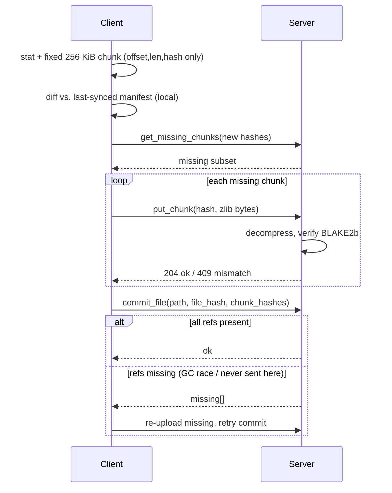
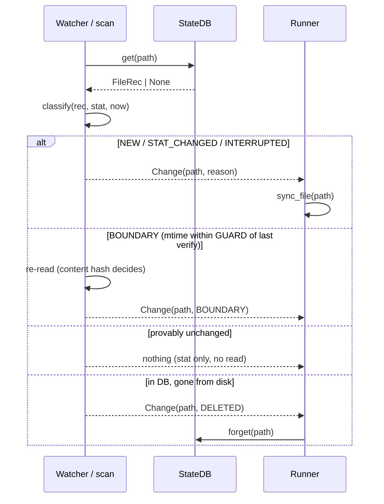

# File Synchronization Utility - Design Document

*Client-side design, `lightweight-portable` branch. The server application exists and is under our control; it appears here only through its client-visible contract. Branch `main` implements the identical protocol on top of third-party libraries; §7 gives the measured comparison.*

## 1. Framing and the key decision

Four requirements: detect changes, minimise bandwidth, survive an unstable connection, prove the server holds an exact copy. Three of them admit inexpensive mechanisms - change detection is a local state database checked against file metadata, reliability is a resumable upload, integrity is a server-side hash check. Bandwidth efficiency is the one that shapes the architecture, and it does so under an assumption worth stating explicitly: **large files tend to change partially**. A design that re-uploads a 3 GB file because 50 KB of it moved has not met the requirement in any environment where the link is the scarce resource.

That assumption points at one structure: a **content-addressed chunk store with per-file manifests**. Split each file into chunks, name every chunk by the hash of its own bytes, and let a file's manifest be the ordered list of those names. The design earns its place because one mechanism then pays three requirements at once:

- **Bandwidth.** A chunk the server already holds - from an earlier version, a different file, or a rename - is never sent again. Deduplication is set membership, not diffing.
- **Reliability.** Because a chunk's address *is* its content, uploading it twice is harmless. Resume after a network drop is not a protocol feature with its own state machine; it is the same set-difference query asked again.
- **Integrity.** Defining a file's identity as the hash of its ordered chunk hashes lets the server prove end-to-end equality by checking set membership plus one small hash, without ever re-reading assembled bytes.

Small files degenerate to a single chunk inside the same pipeline, so there is one design rather than a small-file mode and a large-file mode.

The honest cost is not the chunker but **operating the store**: reference counting, garbage collection, verify-on-write. That cost is accepted deliberately, and it is partly unavoidable - any resumable upload chunks files anyway (S3 multipart is fixed-size chunking added purely for reliability). Chunking merely makes the resume units useful for something else as well.

### 1.1 The second constraint, and what it actually costs

This branch adds a deployment constraint the design has to survive: **the target host may not permit installing compiled extension wheels.** Locked-down build servers, air-gapped environments, and hosts with no C or Rust toolchain are ordinary rather than exotic, and on them `pip install` of a native package is not a slow path - it is a failed one.

So the client and server here use nothing outside the Python standard library except `requests` and `flask`. Concretely, three substitutions:

| | `main` | `lightweight-portable` |
|---|---|---|
| Chunk boundaries | `fastcdc`, content-defined, 64 KiB–1 MiB, ~256 KiB average | fixed 256 KiB, `f.read(CHUNK_SIZE)` |
| Hash | `blake3` (Rust extension) | `hashlib.blake2b(digest_size=32)` |
| Compression | `zstandard` (C extension) | `zlib` level 1 |

The substitution that matters is the first, and it is worth being precise about what it costs rather than waving at "slightly worse dedup".

Content-defined chunking picks boundaries by looking at a rolling hash of the *content*, so a boundary lands after the same byte pattern wherever that pattern appears in the file. Insert one byte at the start of a file and every subsequent boundary lands in the same place relative to the data, so every downstream chunk keeps its old hash and dedups. Fixed-size chunking picks boundaries by *offset*, so the same one-byte insertion shifts every following boundary by one byte and **every downstream chunk gets a new hash**. For that edit pattern, dedup collapses to nothing and the client re-uploads the file's tail.

The loss is real, and it is also **narrow**. Rather than assert that, `sync-demo/evidence/chunking_shift_test.py` measures it: an 8 MiB file, a 50 KiB edit applied three ways, counting the chunks the server would not already hold. Run on both branches:

| Edit (50 KiB on an 8 MiB file) | `main` (content-defined) | this branch (fixed 256 KiB) |
|---|---|---|
| **Overwrite** in place | 3 chunks - 8.8 % | 1 chunk - **3.1 %** |
| **Append** at EOF | 1 chunk - 3.0 % | 1 chunk - **3.0 %** |
| **Insert** at the front | 1 chunk - 3.0 % | 33 chunks - **100 %** |
| **Rename** | 0 bytes | **0 bytes** |

The insert row is the cost: a **33× difference**, and for insert-heavy workloads it is decisive. The other rows are the reason it stays narrow - appends and renames are identical, and on the overwrite tested here fixed-size chunking was actually the *better* of the two, because `main`'s variable boundaries happened to straddle the edit while the fixed ones contained it. That is luck rather than an advantage, and it cuts the other way just as easily; the point is that there is no systematic overwrite penalty, only a systematic *insert* one.

Deduplication across versions, across files, and across renames all still work, because they depend on content addressing rather than on how boundaries are chosen. What is lost is *shift resistance*, specifically and only.

## 2. Client architecture

```
watcher  →  state DB (SQLite)  →  chunker  →  uploader  ⇄  server  →  committer
```

Five independently restartable stages around a SQLite database (WAL mode) holding `files(path, size, mtime_ns, file_hash, manifest, synced_manifest, state)` with states `dirty → chunked → synced`. Each stage's output is durable before the next begins, which is what makes "resume" mean "read the database" rather than "replay a log".

A **watcher** consumes OS file events (inotify/FSEvents/USN) to narrow work to changed paths; a periodic scan reconciles missed events and detects deletions. The database, not the watcher, is the source of truth - an event stream that drops messages under load degrades the *latency* of detection, never its correctness.

The **chunker** splits dirty files into fixed 256 KiB chunks and persists only `(offset, length, BLAKE2b-256)` triples. Chunk data is never retained. The persisted manifest is the resume point: a crash after chunking skips straight to upload.

The **uploader** first diffs the new manifest against the previously-synced one *locally*, asks the server only about hashes it has never sent, then re-reads each missing chunk by offset, compresses it with zlib, and uploads with jittered retries under an adaptive concurrency window (§5). The **committer** publishes the manifest; the server validates that every referenced chunk still exists and returns any collected in the interim for re-upload and retry.



*Figure 1 - `single_file_transfer.py`: one file's transfer - local pre-diff, set-difference upload, self-verifying commit.*

Puts are idempotent because they are content-addressed, and the store verifies on write, so this loop is also how the client survives a network drop mid-upload: reconnect and repeat the same query. There is no separate resume path to get wrong.

## 3. Requirements → mechanisms

### Change detection

Files are keyed by `path → (size, mtime_ns)`. Two rejected alternatives, for the reasons that rejected them:

- **Not inode.** Atomic save-via-rename - write to a temporary file, then `rename()` over the original - is how most editors and many databases write. It allocates a *new* inode for what the user considers the same file, so an inode-keyed store sees every careful save as a delete plus a create.
- **Not ctime.** A `chmod` churns it, and its semantics differ across platforms.

The quick check can prove change but cannot always prove sameness. mtime granularity is coarse on some filesystems (FAT: 2 s), clocks skew, and a write in the same tick as the last read can leave `stat` identical. So the rule is asymmetric: a file whose mtime falls within a guard window of its **last content verification** is reported inconclusive and re-read, with the content hash as the final arbiter.

The anchor is the moment content was last read and matched - never commit time. Anchoring at commit would widen the blind spot by however long the upload took, which is exactly the interval during which a slow link makes a concurrent write most likely.

The check therefore errs toward false positives, which deduplication makes nearly free (one local read, zero new bytes on the wire), and never toward false negatives, which would silently violate integrity.



*Figure 2 - `change_detection.py`: the `classify()` decision - stat-only in the common case, content re-read only at the guard boundary, and the sole unprompted detector of deletions.*

`classify()` is a pure function of `(db record, stat, clock)`, so the boundary arithmetic is unit-testable without a filesystem - and is tested both by example and by generated property (the guard-window invariant holds for *any* mtime/verified-at pair, and the verdict never depends on the clock argument).

### Bandwidth efficiency

Four reductions, stacked, each catching what the previous one lets through:

1. **Unchanged files are skipped from metadata alone.** The common case costs a `stat`, not a read.
2. **Changed files transfer only the chunks the server lacks.** Set difference, not delta encoding.
3. **The query itself stays proportional to the change**, because the client diffs against its own last-synced manifest before asking. This matters more than it looks: a 10 GB file is ~40,000 chunks at 256 KiB, and a naive ask-about-everything query would put ~2.6 MB of hex hashes on the wire *to discover that nothing changed*. Diffing locally first makes the question as small as the answer.
4. **The residue is compressed**, stacking with dedup rather than replacing it.

Compression is zlib level 1 - a deliberate choice of CPU headroom over ratio, on the theory that a host constrained enough to forbid compiled wheels is often constrained enough to notice compression cost.

One consequence is load-bearing and appears again in §6: zlib, like any general-purpose compressor, can make incompressible input *larger*. Measured on random data, a full 1,048,576-byte chunk compresses to 1,048,902 bytes - 326 bytes of DEFLATE framing overhead.

### Reliability

Every step is idempotent or resumes from persisted state:

- Crash during chunking → re-chunk. Local, cheap, no server involvement.
- Crash after chunking → the manifest is already persisted; skip straight to diffing.
- Drop mid-upload → puts are content-addressed and idempotent, so re-query and continue.
- Race between upload and commit → the commit response names any chunk a server-side collection took in the interim; re-upload those and retry.
- Every endpoint down → the pass aborts deliberately, with state intact, and the next pass resumes it. Trying the next file against a link that just failed for every endpoint would only fail again.
- Any *other* per-file exception → logged, and the pass continues with the next file. One pathological file must not take down sync for every other file, let alone the daemon.

Two invariants keep this honest. The file is stat'd **before and after** chunking, and the manifest is abandoned if it moved, so a commit never describes a mix of two file generations. And **resident file data is bounded** at `(LOCAL_WORKERS + MAX_NETWORK_WINDOW) × CHUNK_SIZE` - about 2.5 MB - for a file of any size, because manifests hold offsets and never bytes. Manifest *metadata* does scale with chunk count, at ~44 bytes per chunk in the packed form the state DB stores; at multi-terabyte scale the answer is to spill that packed form to SQLite rather than hold it in memory.

### Integrity

Three verified layers, none of which trusts the layer below:

1. **Every chunk is verified server-side on write.** A content-addressed store that trusts client-supplied keys is poisoned permanently by one bad upload: the wrong bytes then live at a name that every future manifest will dedup against. The server decompresses, recomputes BLAKE2b-256, and returns 409 on mismatch.
2. **The manifest pins ordering.** Chunk identity alone would make a file a multiset of chunks, not a sequence.
3. **The file hash over ordered chunk hashes** lets the server prove end-to-end equality without ever assembling the file, and is recomputed and checked at commit rather than taken from the client.

A 409 is a protocol signal, not a transport failure: it means the disk changed under a chunk that still had to be sent, so the manifest being uploaded is already dead. The client abandons it and re-chunks on the next pass. Retrying it - the natural thing for a transport-level retry loop to do - would loop forever, because the mutated file's `stat` still matches the saved key.

## 4. The state machine that makes resume free

The three states are worth their own section because their transitions are the entire reliability story.

| State | Means | Crash here resumes by |
|---|---|---|
| `dirty` | Needs chunking | Re-chunking. Local and cheap; nothing was sent. |
| `chunked` | Manifest persisted, upload incomplete | Re-asking `get_missing_chunks` for the same manifest. No re-chunking, no re-reading the file. |
| `synced` | Committed; manifest promoted to the dedup baseline | Nothing to do. |

Two manifest slots exist rather than one: `manifest` is the in-flight resume point, and `synced_manifest` is the last committed one. Keeping them separate is what lets the *old* baseline stay usable for deduplication while a *new* sync is in flight - collapsing them into one field would mean a failed sync destroys the dedup baseline that would have made its retry cheap.

`mark_synced` deliberately does **not** touch `verified_at_ns`. The guard anchor is the verification instant recorded when the manifest was saved, and it has to survive a resumed upload unchanged, or a slow upload silently widens the change-detection blind spot by its own duration.

## 5. Adaptive upload concurrency

A static worker count is a single point on a trade-off curve, chosen once by someone who could not see the deployment. Too high, and a constrained host thrashes and a marginal link collapses; too low, and a healthy link sits idle. On a branch whose entire premise is *running well on hosts we do not control*, picking that constant in advance is the wrong shape of answer.

So the number of in-flight uploads is governed by an **additive-increase / multiplicative-decrease** window, the same control law as TCP congestion control, applied to the client's own upload concurrency rather than to a single connection's send window. It starts at 2, grows by one per healthy upload, and halves on a congestion signal, bounded to [1, 8].

Two details make it work rather than oscillate:

- **The congestion signal is a latency gradient, not just loss.** An upload that *succeeds* but takes more than 1.5× the recent baseline counts as congestion. Waiting for outright failure means only reacting after the link has already collapsed; rising latency is the earlier and more actionable signal. The elapsed time deliberately includes the call's own retry and backoff, so a chunk that only landed on its third attempt is correctly counted as a slow sample whatever the cause.
- **The baseline is an EWMA updated only from non-congested successes.** If congested samples fed the baseline, a run of backoffs would drag the baseline up behind them and the controller would gradually accept its own degradation as the new normal, masking the next real spike.

The window lives on the transport, one per client-to-servers connection, and is shared across every file. A per-file controller would reset the learned window and the RTT baseline on every file and never grow past its initial value for a workload of many small files. The accepted simplification is that congestion signal from the primary and secondary endpoints is mixed; separating them would mean moving the controller onto the endpoint.

Reads are staffed separately from uploads - two `ThreadPoolExecutor`s, not one pool sized to their sum. This is not stylistic. A thread parked in `controller.acquire()` or sleeping in retry backoff is holding a *network* pool slot, and in a shared pool that slot is one a pending disk read cannot get. Separate pools mean local disk and CPU work genuinely cannot be starved by network backoff. A semaphore across both stages provides the backpressure that stops reads racing arbitrarily far ahead of a stalled network and buffering unbounded payload data.

## 6. One constant, three forces

`CHUNK_SIZE = 256 KiB` is worth singling out because three independent pressures converge on roughly the same answer, and the first two were found empirically rather than reasoned about in advance.

**A proxy's body-size cap.** nginx defaults `client_max_body_size` to 1 MiB. With a 1 MiB chunk and zlib's worst-case expansion on incompressible data (measured above: +326 bytes), a full-size chunk of already-compressed or random content exceeds the cap and is rejected with **413** - reliably, not occasionally. This is a genuine cross-branch hazard that `main` merely hits less often, because content-defined boundaries rarely land exactly at the maximum. Both branches now raise the cap in `nginx.conf` as defence in depth, but the client should not depend on controlling a proxy it may not own.

**Read-timeout headroom under loss.** At the previous 1023 KiB, a single chunk PUT over a 10 %-loss / 100 ms-delay link was large enough to meaningfully risk tripping the transport's read timeout. Each such timeout counted as an endpoint failure, and enough of them in a row marked *both* endpoints unhealthy - so a link that was merely degraded produced failover flapping, and the pass spent its budget switching endpoints instead of making upload progress. A smaller chunk transfers faster individually and triggers that mode far less often. The complementary fix was raising the failure threshold from 3 to 5, so a handful of losses in a row no longer looks like an outage.

**Comparability.** 256 KiB is also `main`'s average content-defined chunk size, which makes the A/B in §7 a comparison of *boundary strategy* rather than of chunk size.

The interesting part is that the first two pressures push in the same direction as the third for unrelated reasons. That is the sort of coincidence worth recording in a comment, because the next person to consider raising the constant for throughput needs to know it will reintroduce two failure modes, not one.

## 7. What the portability constraint costs, measured

Both branches were run through the identical scenario scripts against a fresh two-server-plus-proxy Docker stack with real `tc`/`netem` shaping, sequentially, with a full teardown between. `sync-demo/evidence/ab_benchmark.py` samples container resource usage across the run, so the comparison is reproducible from a clean clone rather than assembled by hand.

The full comparison is in [`sync-demo/tradeoff_analysis.md`](../../sync-demo/tradeoff_analysis.md), with the per-branch raw results under [`evidence/`](../../evidence/). Three findings, none of which were the expected ones:

**Dedup.** Confined to the shift case, exactly as §1.1 measures. Appends and renames are identical; overwrites showed no systematic difference.

**Resilience.** This branch was the *more* robust of the two under loss, not the less: it converged at 30 % loss / 100 ms where `main` timed out inside the same 90 s bound, and was faster at 10 % / 100 ms (10.7 s vs 18.0 s). `main` was faster on a clean link (2.1 s vs 3.2 s) and at 10 % / 50 ms. That ordering matches the designs - 8 static workers over larger chunks fill a healthy pipe better, while a smaller chunk plus a window that halves on a latency gradient survives a bad one better - but these are single runs of a stochastic process and the direction, not the seconds, is the result.

**Resources.** The portable client trades CPU for memory as expected: 87 % vs 56 % peak CPU (zlib and blake2b cost more per byte than zstd and BLAKE3), against 30 MiB vs 52 MiB peak resident memory (a smaller chunk and a window starting at 2 rather than 8 workers buffer far less at once).

The comparison was not always this close. Earlier in this branch's development, at a larger chunk size and with the transport's original thresholds, the degraded-link step did not converge inside its budget at all. That is recorded rather than quietly fixed, because the useful finding is not the final number but *which* constant was load-bearing: chunk size and failure threshold, not hash or compressor choice.

## 8. Boundaries and trade-offs

**Where fixed-size chunking is the wrong call.** If the workload is dominated by insertions into large files - version-controlled prose, uncompressed media edited in place, anything where bytes shift rather than overwrite - the shift-resistance loss in §1.1 stops being narrow and becomes the dominant cost. On that workload, `main` is the correct branch, and the right answer is to install the compiled wheel.

**Where the whole chunk-store approach is the wrong call.** Content addressing earns its cost when bytes are shared - across versions, files, or renames. A workload of unique, write-once, never-edited files pays the store's reference counting and verify-on-write for deduplication that will never fire; plain resumable uploads would do. Append-only logs deserve a special case in either branch: track the synced offset and ship only the tail, which is strictly cheaper than re-chunking to discover that only the last chunk changed.

**Against rsync's rolling-checksum delta.** rsync solves a genuinely different problem: pairwise delta between two *known* copies. It is better than this design at exactly one thing - for a single point edit, its block size (≈√filesize) can move less data than one chunk here. It is worse at three: the server re-checksums the whole file on every transfer, blocks shared across *different* files or across a rename are re-sent, and resume needs its own mechanism. This design reduces the server to set membership, deduplicates globally, and gets resume for free.

**A privacy boundary that deduplication creates.** Under cross-account deduplication, `get_missing_chunks` becomes a confirmation oracle: an attacker who guesses a chunk's exact bytes learns whether *anyone* holds it. This is not hypothetical - it is the standard attack on cross-user dedup. Closed by per-account dedup namespaces, or by proof-of-possession before a "you already have this" answer is given. Out of scope here, but it is a property of the architecture rather than of the implementation, so it belongs in the design document rather than in a TODO.

**Known limits, stated plainly.** A forged `utime()` defeats any metadata-based change check; the answer is a periodic full-hash sweep, not a cleverer `stat`. The two servers are independent stores and do not replicate, so failover is an availability story, not a durability one. Chunk garbage collection is stubbed - the commit path is already race-safe against a GC that does not yet exist. Authentication is an opt-in shared secret, not per-client identity.

---

*A full working reference implementation accompanies this document: the two modules the brief asks for (`change_detection.py`, `single_file_transfer.py`), an HTTP transport with multi-server failover, a matching server, a test suite spanning unit, property-based and integration levels, and a Docker demo with real network-fault injection (`sync-demo/`, see its `README.md` to run it).*
