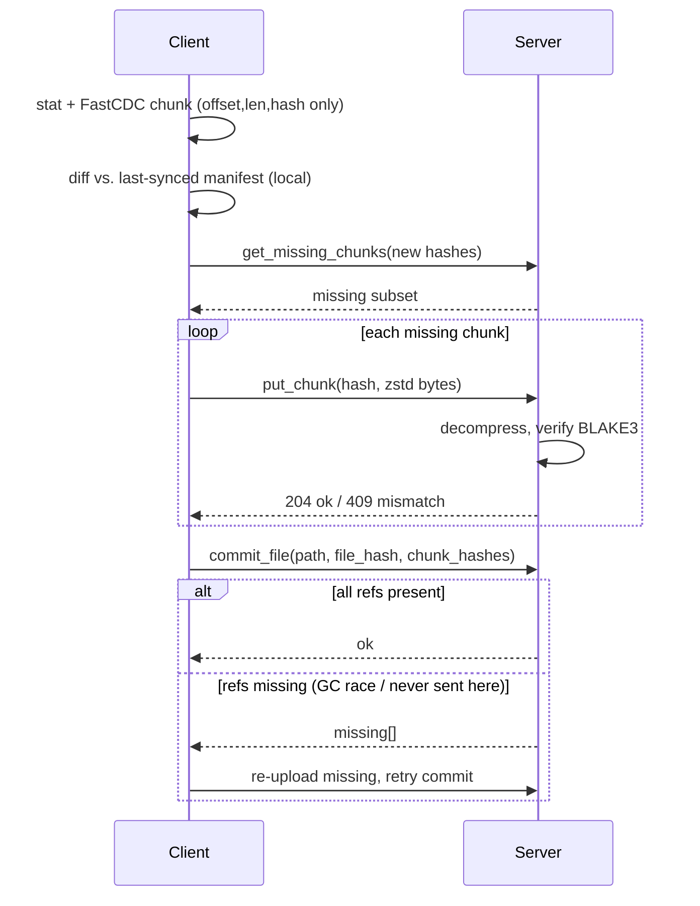
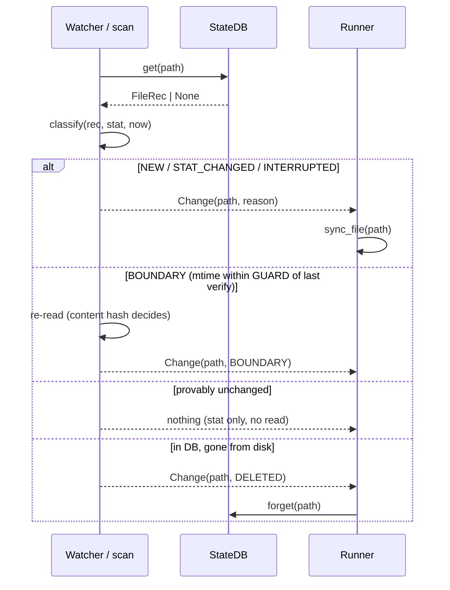

# File Synchronization Utility - Design Document

*Client-side design, `main` branch. The server application exists and is under our control; it appears here only through its client-visible contract. Branch `lightweight-portable` implements the identical protocol using only the standard library; §7 gives the measured comparison.*

## 1. Framing and the key decision

Four requirements: detect changes, minimise bandwidth, survive an unstable connection, prove the server holds an exact copy. Three of them admit inexpensive mechanisms - change detection is a local state database checked against file metadata, reliability is a resumable upload, integrity is a server-side hash check. Bandwidth efficiency is the one that shapes the architecture, and it does so under an assumption worth stating explicitly: **large files tend to change partially**. A design that re-uploads a 3 GB file because 50 KB of it moved has not met the requirement in any environment where the link is the scarce resource.

That assumption points at one structure: a **content-addressed chunk store with per-file manifests**, fed by **content-defined chunking** (FastCDC) on the client. Split each file into chunks whose boundaries are chosen by the content itself, name every chunk by the hash of its own bytes, and let a file's manifest be the ordered list of those names. The design earns its place because one mechanism then pays three requirements at once:

- **Bandwidth.** A chunk the server already holds - from an earlier version, a different file, or a rename - is never sent again. Deduplication is set membership, not diffing.
- **Reliability.** Because a chunk's address *is* its content, uploading it twice is harmless. Resume after a network drop is not a protocol feature with its own state machine; it is the same set-difference query asked again.
- **Integrity.** Defining a file's identity as the hash of its ordered chunk hashes lets the server prove end-to-end equality by checking set membership plus one small hash, without ever re-reading assembled bytes.

Small files degenerate to a single chunk inside the same pipeline, so there is one design rather than a small-file mode and a large-file mode.

The honest cost is not the chunker - a gear-hash FastCDC is small - but **operating the store**: reference counting, garbage collection, verify-on-write. That cost is accepted deliberately, and it is partly unavoidable: any resumable upload chunks files anyway (S3 multipart is fixed-size chunking added purely for reliability). Content-defined chunking merely makes the resume units deduplication-friendly.

### 1.1 Why content-defined boundaries, and what they cost

This branch accepts three compiled dependencies - `fastcdc`, `blake3`, `zstandard` - to buy one specific property, and it is worth being precise about which.

Fixed-size chunking picks boundaries by *offset*. Insert one byte at the start of a file and every following boundary shifts by one byte, so every downstream chunk gets a new hash and dedup collapses for that edit. Content-defined chunking picks boundaries from a rolling hash of the *content*, so a boundary lands after the same byte pattern wherever that pattern appears. The same insertion leaves every downstream boundary in the same place relative to the data, and the chunks after the edit still match.

`sync-demo/evidence/chunking_shift_test.py` measures this rather than asserting it - an 8 MiB file, a 50 KiB edit applied three ways, counting the chunks the server would not already hold:

| Edit (50 KiB on an 8 MiB file) | this branch (content-defined) | `lightweight-portable` (fixed 256 KiB) |
|---|---|---|
| **Overwrite** in place | 3 chunks - 8.8 % | 1 chunk - 3.1 % |
| **Append** at EOF | 1 chunk - **3.0 %** | 1 chunk - 3.0 % |
| **Insert** at the front | 1 chunk - **3.0 %** | 33 chunks - 100 % |
| **Rename** | **0 bytes** | 0 bytes |

The insert row is what the dependencies buy: a **33× reduction** in bytes on the wire for a shifting edit. The overwrite row is the honest counterweight - fixed-size chunking did *better* there, because these variable boundaries happened to straddle the edit while the fixed ones contained it. That is luck rather than a systematic advantage in either direction, and it would reverse at a different offset. Appends and renames are identical under both.

So the dependency cost buys exactly one thing: **shift resistance**. That is worth three compiled wheels on an insert-heavy workload and worth nothing on an append-only one. §7 covers the environments where the trade goes the other way.

Chunking parameters are 64 KiB minimum, 256 KiB average, 1 MiB maximum. The minimum stops a pathological content pattern from producing thousands of tiny chunks and a manifest larger than the data it describes; the maximum bounds both a single request's size and the resident-memory calculation below.

## 2. Client architecture

```
watcher  →  state DB (SQLite)  →  chunker  →  uploader  ⇄  server  →  committer
```

Five independently restartable stages around a SQLite database (WAL mode) holding `files(path, size, mtime_ns, file_hash, manifest, synced_manifest, state)` with states `dirty → chunked → synced`. Each stage's output is durable before the next begins, which is what makes "resume" mean "read the database" rather than "replay a log".

A **watcher** consumes OS file events (inotify/FSEvents/USN) to narrow work to changed paths; a periodic scan reconciles missed events and detects deletions. The database, not the watcher, is the source of truth - an event stream that drops messages under load degrades the *latency* of detection, never its correctness.

The **chunker** runs FastCDC (64 KiB min / 256 KiB avg / 1 MiB max) over dirty files and persists only `(offset, length, BLAKE3)` triples. Chunk data is never retained. The persisted manifest is the resume point: a crash after chunking skips straight to upload.

The **uploader** first diffs the new manifest against the previously-synced one *locally*, asks the server only about hashes it has never sent, then a bounded worker pool re-reads each missing chunk by offset, compresses it with zstd, and uploads with jittered retries. The **committer** publishes the manifest; the server validates that every referenced chunk still exists and returns any collected in the interim for re-upload and retry.



*Figure 1 - `single_file_transfer.py`: one file's transfer - local pre-diff, set-difference upload, self-verifying commit.*

Puts are idempotent because they are content-addressed, and the store verifies on write, so this loop is also how the client survives a network drop mid-upload: reconnect and repeat the same query. There is no separate resume path to get wrong.

## 3. Requirements → mechanisms

### Change detection

Files are keyed by `path → (size, mtime_ns)`. Two rejected alternatives, for the reasons that rejected them:

- **Not inode.** Atomic save-via-rename - write to a temporary file, then `rename()` over the original - is how most editors and many databases write. It allocates a *new* inode for what the user considers the same file, so an inode-keyed store sees every careful save as a delete plus a create.
- **Not ctime.** A `chmod` churns it, and its semantics differ across platforms.

The quick check can prove change but cannot always prove sameness. mtime granularity is coarse on some filesystems (FAT: 2 s), clocks skew, and a write in the same tick as the last read can leave `stat` identical. So the rule is asymmetric: a file whose mtime falls within a guard window of its **last content verification** is reported inconclusive and re-read, with the content hash as the final arbiter.

The anchor is the moment content was last read and matched - never commit time. Anchoring at commit would widen the blind spot by however long the upload took, which is exactly the interval during which a slow link makes a concurrent write most likely.

The check therefore errs toward false positives, which deduplication makes nearly free (one local read, zero new bytes on the wire), and never toward false negatives, which would silently violate integrity.



*Figure 2 - `change_detection.py`: the `classify()` decision - stat-only in the common case, content re-read only at the guard boundary, and the sole unprompted detector of deletions.*

`classify()` is a pure function of `(db record, stat, clock)`, so the boundary arithmetic is unit-testable without a filesystem - and is tested both by example and by generated property (the guard-window invariant holds for *any* mtime/verified-at pair, and the verdict never depends on the clock argument).

### Bandwidth efficiency

Four reductions, stacked, each catching what the previous one lets through:

1. **Unchanged files are skipped from metadata alone.** The common case costs a `stat`, not a read.
2. **Changed files transfer only the chunks the server lacks.** Set difference, not delta encoding - and thanks to content-defined boundaries, that set stays small even when the edit shifts everything after it.
3. **The query itself stays proportional to the change**, because the client diffs against its own last-synced manifest before asking. This matters more than it looks: a 10 GB file is ~40,000 chunks at the 256 KiB average, and a naive ask-about-everything query would put ~2.6 MB of hex hashes on the wire *to discover that nothing changed*. Diffing locally first makes the question as small as the answer.
4. **The residue is zstd-compressed**, stacking with dedup rather than replacing it.

### Reliability

Every step is idempotent or resumes from persisted state:

- Crash during chunking → re-chunk. Local, cheap, no server involvement.
- Crash after chunking → the manifest is already persisted; skip straight to diffing.
- Drop mid-upload → puts are content-addressed and idempotent, so re-query and continue.
- Race between upload and commit → the commit response names any chunk a server-side collection took in the interim; re-upload those and retry.
- Every endpoint down → the pass aborts deliberately, with state intact, and the next pass resumes it. Trying the next file against a link that just failed for every endpoint would only fail again.
- Any *other* per-file exception → logged, and the pass continues with the next file. One pathological file must not take down sync for every other file, let alone the daemon.

Two invariants keep this honest. The file is stat'd **before and after** chunking, and the manifest is abandoned if it moved, so a commit never describes a mix of two file generations. And **resident file data is bounded** at `WORKERS × MAX_CHUNK` - 8 MiB - for a file of any size, because manifests hold offsets and never bytes. Manifest *metadata* does scale with chunk count, at ~44 bytes per chunk in the packed form the state DB stores; at multi-terabyte scale the answer is to spill that packed form to SQLite rather than hold it in memory.

### Integrity

Three verified layers, none of which trusts the layer below:

1. **Every chunk is verified server-side on write.** A content-addressed store that trusts client-supplied keys is poisoned permanently by one bad upload: the wrong bytes then live at a name that every future manifest will dedup against. The server decompresses, recomputes BLAKE3, and returns 409 on mismatch.
2. **The manifest pins ordering.** Chunk identity alone would make a file a multiset of chunks, not a sequence.
3. **The file hash over ordered chunk hashes** lets the server prove end-to-end equality without ever assembling the file, and is recomputed and checked at commit rather than taken from the client.

A 409 is a protocol signal, not a transport failure: it means the disk changed under a chunk that still had to be sent, so the manifest being uploaded is already dead. The client abandons it and re-chunks on the next pass. Retrying it - the natural thing for a transport-level retry loop to do - would loop forever, because the mutated file's `stat` still matches the saved key.

## 4. The state machine that makes resume free

| State | Means | Crash here resumes by |
|---|---|---|
| `dirty` | Needs chunking | Re-chunking. Local and cheap; nothing was sent. |
| `chunked` | Manifest persisted, upload incomplete | Re-asking `get_missing_chunks` for the same manifest. No re-chunking, no re-reading the file. |
| `synced` | Committed; manifest promoted to the dedup baseline | Nothing to do. |

Two manifest slots exist rather than one: `manifest` is the in-flight resume point, and `synced_manifest` is the last committed one. Keeping them separate is what lets the *old* baseline stay usable for deduplication while a *new* sync is in flight - collapsing them into one field would mean a failed sync destroys the dedup baseline that would have made its retry cheap.

`mark_synced` deliberately does **not** touch `verified_at_ns`. The guard anchor is the verification instant recorded when the manifest was saved, and it has to survive a resumed upload unchanged, or a slow upload silently widens the change-detection blind spot by its own duration.

## 5. Concurrency and the failure model

Uploads run on a bounded worker pool (`WORKERS = 8`), which is also the term in the resident-memory bound above: a static ceiling means the memory calculation is a multiplication rather than an estimate, and a large batch of changed files cannot saturate host disk or CPU no matter how many arrive at once.

Retry backoff is deliberately **per worker, not per batch**. A batch-level retry loop reintroduces head-of-line blocking: one slow chunk stalls seven healthy streams. Per-worker backoff with jitter lets independent streams keep progressing and desynchronises their retries so they do not re-collide.

Failover between servers is layered underneath that, and the layering is the point. `HttpServer` moves between endpoints with **no delay** - a connection error, timeout or 5xx just tries the next one. `_retry` backs off **per chunk**. The run loop treats a pass that still fails as "try again next interval, state intact". Each layer handles the failure class it can actually see: the transport knows which endpoint failed, the chunk retry knows a single request failed, and the run loop knows the whole link is down.

Failover is about **availability**, not replication. The two servers are independent stores; a file committed to the secondary during an outage stays there. That is a deliberate architectural choice rather than a gap - making them redundant means changing the failover model, not patching it.

## 6. One constant worth singling out

`MAX_CHUNK = 1 MiB` interacts with something outside the client: nginx defaults `client_max_body_size` to exactly 1 MiB, and a compressor can make incompressible input *larger* than its input. A maximum-size chunk of already-compressed or random content can therefore exceed the cap and be rejected with **413**. Content-defined boundaries rarely land exactly at the maximum, so this branch hits it far less often than a fixed 1 MiB chunker would - but "rarely" is not "never", and a client should not depend on controlling a proxy it may not own. `nginx.conf` raises the cap as defence in depth.

The general lesson is worth more than the specific constant: a chunk size is not only a dedup-granularity knob. It is simultaneously a request size, a retry unit, a memory multiplier, and - as here - a value that has to clear whatever middlebox sits between the client and the store.

## 7. Where this design is the wrong choice

**When compiled dependencies are not installable.** `fastcdc`, `blake3` and `zstandard` are C/Rust extensions. On a locked-down build host, an air-gapped environment, or anything without a toolchain, `pip install` is not a slow path but a failed one. `lightweight-portable` implements the same protocol with `hashlib.blake2b`, `zlib` and fixed 256 KiB chunking, at the cost measured in §1.1 - and, in the same benchmark run, it was the *more* robust of the two under packet loss, converging at 30 % loss / 100 ms where this branch timed out inside the same 90 s bound. Single runs of a stochastic process, so the direction is the finding rather than the seconds; the mechanism is understood, though, and it is the adaptive concurrency window that branch uses in place of eight static workers. Full comparison: [`sync-demo/tradeoff_analysis.md`](../../sync-demo/tradeoff_analysis.md).

**When bytes never shift.** Content-defined chunking earns its cost only when bytes move *inside* large files. Whole-file-rewrite workloads would do just as well with fixed-size chunks at less CPU, and append-only logs deserve a special case in either branch - track the synced offset and ship only the tail, which is strictly cheaper than re-chunking to discover that only the last chunk changed.

**When nothing is ever shared.** Content addressing earns its cost when bytes are shared across versions, files, or renames. A workload of unique, write-once, never-edited files pays the store's reference counting and verify-on-write for deduplication that will never fire.

**Against rsync's rolling-checksum delta.** rsync solves a genuinely different problem: pairwise delta between two *known* copies. It is better than this design at exactly one thing - for a single point edit, its block size (≈√filesize) can move less data than one average chunk here. It is worse at three: the server re-checksums the whole file on every transfer, blocks shared across *different* files or across a rename are re-sent, and resume needs its own mechanism. This design reduces the server to set membership, deduplicates globally, and gets resume for free.

**A privacy boundary that deduplication creates.** Under cross-account deduplication, `get_missing_chunks` becomes a confirmation oracle: an attacker who guesses a chunk's exact bytes learns whether *anyone* holds it. This is the standard attack on cross-user dedup, not a hypothetical. Closed by per-account dedup namespaces, or by proof-of-possession before a "you already have this" answer is given. Out of scope here, but it is a property of the architecture rather than of the implementation, so it belongs in the design document rather than in a TODO.

**Known limits, stated plainly.** A forged `utime()` defeats any metadata-based change check; the answer is a periodic full-hash sweep, not a cleverer `stat`. Chunk garbage collection is stubbed - the commit path is already race-safe against a GC that does not yet exist. Authentication is an opt-in shared secret, not per-client identity.

---

*A full working reference implementation accompanies this document: the two modules the brief asks for (`change_detection.py`, `single_file_transfer.py`), an HTTP transport with multi-server failover, a matching server, a test suite spanning unit, property-based and integration levels, and a Docker demo with real network-fault injection (`sync-demo/`, see its `README.md` to run it).*
