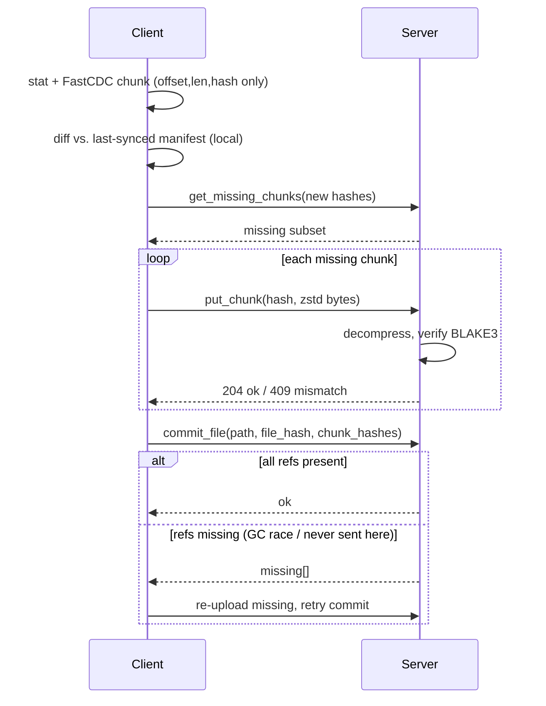
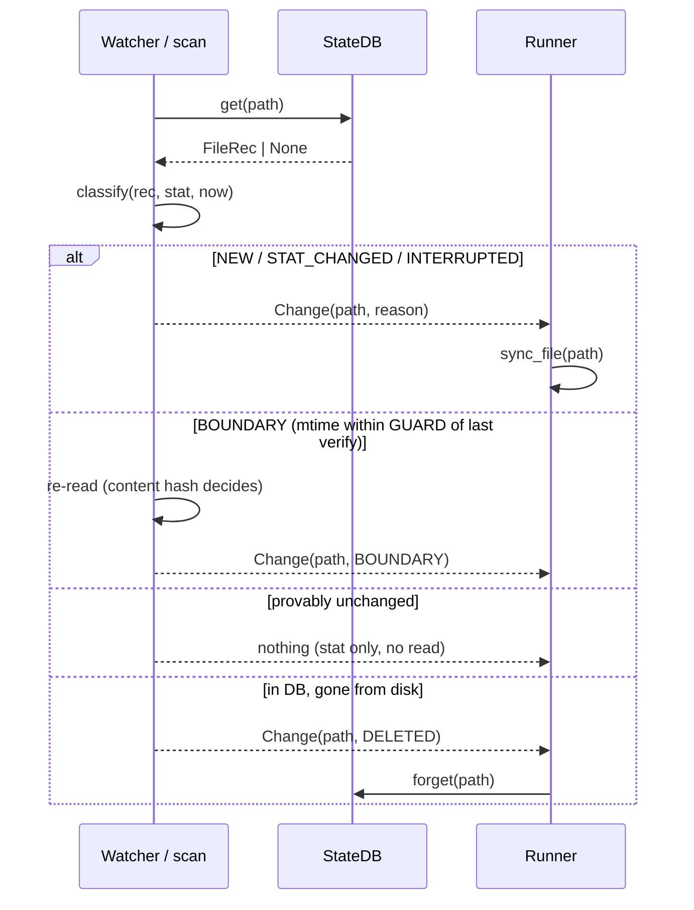

# File Synchronization Utility — Design Document

*Client-side design. The server application exists and is under our control; it appears here only through its client-visible contract.*

## 1. Framing and the key decision

Three of the four requirements admit inexpensive mechanisms: change detection is a local state database checked against file metadata; reliability is a resumable upload; integrity is a server-side hash check. Bandwidth efficiency is the requirement that shapes the architecture, and it does so under an assumption worth stating explicitly: **large files tend to change partially**. Given that assumption, the design is a content-addressed chunk store with per-file manifests, fed by content-defined chunking (FastCDC) on the client.

One mechanism then pays three requirements. Chunk-level deduplication against everything the server already holds serves bandwidth: only genuinely new bytes cross the wire — across versions, across files, and across renames (a rename becomes a metadata-only commit). Content-addressed uploads are idempotent, so resuming after a network failure is not a protocol feature but a repeated set-difference query — reliability falls out. Defining a file's identity as the hash of its ordered chunk hashes gives the server end-to-end verification by set membership plus one small hash, without ever re-reading assembled bytes — integrity falls out. Small files degenerate to a single chunk inside the same pipeline, so there is one design rather than a small-file mode and a large-file mode.

The honest cost is not the chunker (a gear-hash FastCDC is small) but operating the store: reference counting, garbage collection, verify-on-write. That cost is accepted deliberately, and it is partly unavoidable — any resumable upload chunks files anyway (S3 multipart is fixed-size chunking added purely for reliability); content-defined chunking merely makes the resume units deduplication-friendly.

## 2. Client architecture

```
watcher  →  state DB (SQLite)  →  chunker  →  uploader  ⇄  server  →  committer
```

The client is a pipeline of five independently restartable stages around a SQLite database (WAL mode) holding `files(path, size, mtime_ns, file_hash, manifest, state)` with states `dirty → chunked → synced`. A **watcher** consumes OS file events (inotify/FSEvents/USN) to narrow work to changed paths; a periodic scan reconciles missed events and detects deletions — the database, not the watcher, is the source of truth. The **chunker** runs FastCDC (64 KB min / 256 KB avg / 1 MB max) over dirty files and persists only `(offset, length, BLAKE3)` triples — chunk data is never retained. The persisted manifest is the resume point: a crash after chunking skips straight to upload.

The **uploader** first diffs the new manifest against the previously-synced one locally, asks the server only about hashes it has never sent, then a bounded worker pool re-reads each missing chunk by offset, compresses it with zstd, and uploads with jittered retries. The **committer** publishes the manifest; the server validates every referenced chunk still exists and returns any collected in the interim for re-upload and retry:



*Figure 1 — `single_file_transfer.py`: one file's transfer — local pre-diff, set-difference upload, self-verifying commit.*

Puts are idempotent (content-addressed) and the store is self-verifying, so this loop is also how the client survives a network drop mid-upload: reconnect and repeat the same query — no special resume path.

## 3. Requirements → mechanisms

**Change detection.** Files are keyed by `path → (size, mtime_ns)`. Inode numbers are avoided (atomic save-via-rename allocates a new one); ctime is avoided (permission changes churn it, semantics vary by platform). Because mtime can lie — coarse filesystem granularity, clock skew — a file whose mtime sits within a guard window of the last verification is re-hashed rather than skipped; the content hash is the final arbiter. Events narrow the work, scans reconcile it.



*Figure 2 — `change_detection.py`: the `classify()` decision — stat-only in the common case, content re-read only at the guard boundary, and the sole detector of deletions.*

**Bandwidth efficiency.** Four stacked reductions: unchanged files are skipped from metadata alone; changed files transfer only the chunks the server lacks; the *query* itself stays proportional to the change because the client diffs locally first (a naive ask-about-everything query on a 10 GB file is ~1.3 MB by itself); the residue is zstd-compressed, stacking with dedup rather than replacing it.

**Reliability.** Every step is idempotent or resumes from persisted state: a crash during chunking just re-chunks (local, cheap); after chunking, the manifest is persisted and the client skips straight to diffing; mid-upload, puts are idempotent so the client re-queries and continues; between upload and commit, the commit response names any chunk that raced a server-side collection. Two invariants keep this honest: the file is stat'd before *and* after chunking, abandoning the manifest if it moved (never commit a mix of two file generations); and resident memory equals *workers × max chunk size* regardless of file size, because manifests hold offsets, never bytes.

**Integrity.** Three verified layers: every chunk is verified server-side on write (a content-addressed store that trusts client-supplied keys is poisoned by one bad upload); the manifest pins ordering; the file hash over ordered chunk hashes lets the server prove end-to-end equality without ever assembling the file.

## 4. Boundaries and trade-offs

Content-defined chunking earns its cost only when bytes shift *inside* large files; whole-file-rewrite workloads would do just as well with fixed-size chunks at less CPU, and append-only logs deserve a special case (track the synced offset, ship only the tail). Against rsync's rolling-checksum delta: rsync solves pairwise delta between two *known* copies (the server re-checksums on every transfer, and blocks shared across files or renames are re-sent); this design reduces the server to set membership, deduplicates globally, and makes resume a query — at the conceded cost that for one point edit, rsync's block size (≈√filesize) can move less data than one average chunk. Finally, under cross-account deduplication, `get_missing_chunks` becomes a confirmation oracle (does *anyone* hold this chunk?) — closed by per-account dedup namespaces or proof-of-possession.

---

*This is not just a design on paper: a full working reference implementation accompanies this document — the two code snippets requested (`change_detection.py`, `single_file_transfer.py`), an HTTP transport with multi-server failover, a matching server, an audited test suite, and a Docker-based demo with real network-fault injection (`sync-demo/`, see its `README.md` to run it).*
