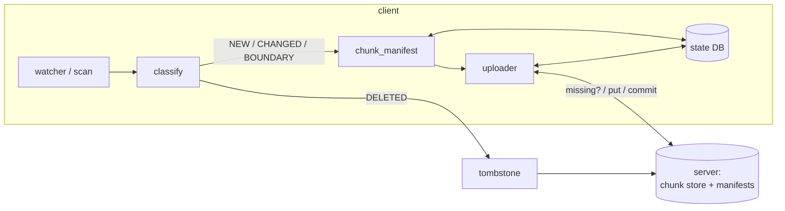
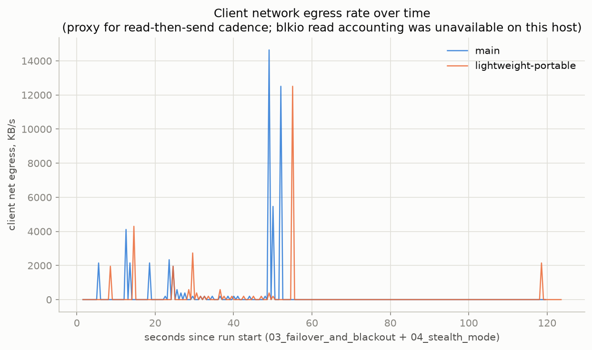
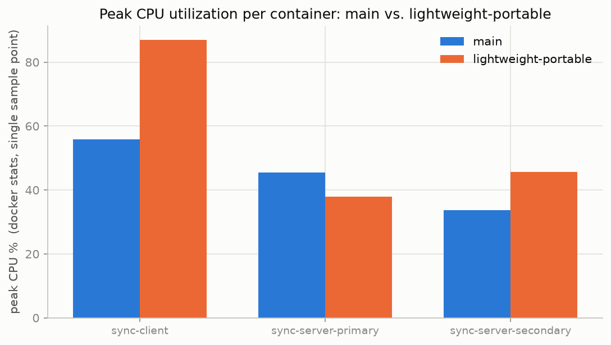
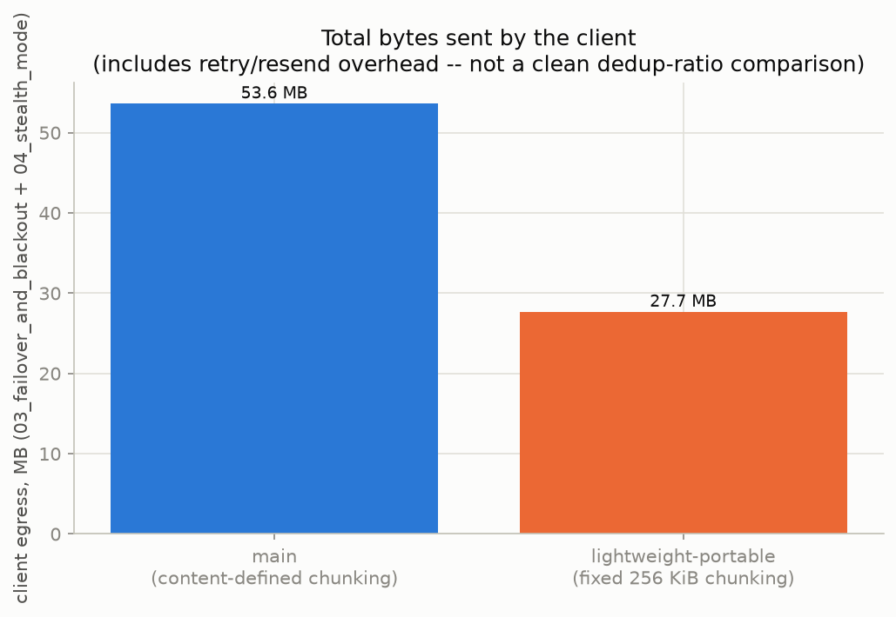

# file-delta-relay / sync-demo - Final Report (`lightweight-portable`)

**Status: all suites green, all four Docker scenarios exit 0, every figure and
metric in this report regenerated from a single clean run against the code as
committed. Zero known open issues.**

This report is the single source of truth for the finished project: what it
does, how it meets the brief, what was found and fixed during the audit, and how
to reproduce every claim below from a clean clone.

> **Which branch this is.** `lightweight-portable` implements the client and
> server using nothing outside the Python standard library except `requests` and
> `flask`: fixed-size 256 KiB chunking, `hashlib.blake2b`, `zlib`, and an
> adaptive upload-concurrency window. Branch `main` implements the same protocol
> with `fastcdc` content-defined chunking, BLAKE3 and zstd. Neither is a
> reduced-functionality version of the other - they pass the same suites and the
> same scenarios. [`tradeoff_analysis.md`](tradeoff_analysis.md) is the measured
> comparison; [`../evidence/`](../evidence/) holds both branches' raw results
> side by side.

---

## 1. Executive summary

`sync-demo` is a client/server file-synchronisation system built around four
requirements - **change detection, bandwidth efficiency, reliability, and
integrity** - plus a demonstration **offensive-use-case mode** layered on the
same, unmodified client: traffic that resembles a telemetry/analytics API,
randomised polling, per-file endpoint spreading, a domain-fronting reverse
proxy, and optional source deletion after a successful sync.

The core client is two small, independently tested modules -
`change_detection.py` (a pure decision kernel plus a SQLite state store) and
`single_file_transfer.py` (fixed-size chunking, dedup, resumable upload, an AIMD
concurrency controller) - driven by an HTTP transport (`transport.py`) with
multi-server failover. The server (`server/app.py`) is a deliberately small
content-addressed chunk store that still enforces the two invariants correctness
depends on: verify-on-write (BLAKE2b-256, recomputed server-side) and
reference-validated commits.

Everything is demonstrated twice: once in a few seconds with no Docker
(`./demo.sh quick` - the real server as a subprocess, the real HTTP client
driving it), and once against the full two-server-plus-proxy Docker stack with
real `tc`/`netem` network emulation.

The single most compact piece of evidence in this report is §6.3's resume
arithmetic: a 6 MB file is 24 chunks, an interrupted pass sent exactly 3 of
them, the resumed pass sent exactly the remaining 21, and the totals add up to
the byte. Not "no duplicates observed" - no duplicates *possible* to hide.

---

## 2. Architecture overview

```text
sync-demo/
├── server/            Flask server: content-addressed chunk store + RPCs
├── client/            the two assessed modules + the HTTP transport
│   ├── change_detection.py        (pure kernel + SQLite state store)
│   ├── single_file_transfer.py    (chunking, dedup, resumable upload, AIMD)
│   └── transport.py               (HTTP contract, failover, run loop)
├── scenarios/         01–05: normal sync, interrupted resume, failover +
│                      blackout, stealth mode, interactive walkthrough
├── tests/             unit + property-based (kernel) + integration (real HTTP)
├── evidence/          instrumented harnesses this report's plots come from
├── plots/             the six generated evidence figures (§8)
├── figures/           mermaid sequence diagrams for the design document
├── utils/             tc/netem helper
├── nginx/             front proxy for the domain-fronting demonstration
├── certs/             throwaway TLS CA + server cert generator
├── demo.sh            one-command runner: quick | full | walkthrough
└── docker-compose.yml two servers + Nginx front proxy + client
```

### Data flow



- **`classify()`** (`change_detection.py`) is a pure function of
  `(db record, stat, clock)`: NEW / STAT_CHANGED / BOUNDARY / INTERRUPTED /
  DELETED / *provably unchanged*. It is the only place the "did this file
  change" policy lives, and it is tested both by example and by generated
  property without touching a filesystem.
- **`chunk_manifest()` / `sync_file()`** (`single_file_transfer.py`) split a
  changed file into fixed 256 KiB chunks (BLAKE2b-256 per chunk), diff against
  the client's own last-synced baseline, ask the server what it is still
  missing, upload only that, and commit. A manifest holds
  `(offset, length, hash)` only - never chunk bytes - so resident file data is
  bounded at `(LOCAL_WORKERS + MAX_NETWORK_WINDOW) × CHUNK_SIZE`, about 2.5 MB,
  regardless of file size.
- **`AIMDController`** governs how many uploads are in flight: additive
  increase on healthy uploads, multiplicative decrease on failure *or* on a
  latency spike past 1.5× the recent baseline. One controller per transport,
  shared across files, so the learned window survives between them.
- **`HttpServer` / `run_once()`** (`transport.py`) implement the four-call
  server contract over HTTP against one or more servers in priority order, with
  active health probing, automatic failover, and failback.
- **`server/app.py`** is a content-addressed store: chunks live at their
  BLAKE2b-256 hex digest, so puts are idempotent and dedup is set membership;
  every chunk is re-hashed on receipt and every commit is checked against the
  store before it is accepted.

### Single-file transfer, in detail

```mermaid
sequenceDiagram
    participant C as client (sync_file)
    participant DB as StateDB
    participant S as server
    C->>C: stat, chunk_manifest (offsets+hashes only)
    C->>C: record verified_at; stat again  [torn-read guard]
    C->>DB: save_chunked(manifest, verified_at)
    C->>DB: prev_hashes(path)        %% local dedup baseline
    C->>S: get_missing_chunks(new hashes)
    S-->>C: missing subset
    loop each missing chunk
        C->>C: pread(offset,len) · zlib -1
        C->>S: put_chunk(hash, payload)
        S->>S: decompress · verify BLAKE2b
        alt hash ok
            S-->>C: 204
        else mismatch
            S-->>C: 409 -> ChunkRejected -> mark_dirty, re-chunk next pass
        end
    end
    C->>S: commit_file(path, file_hash, chunk_hashes)
    alt all refs present
        S-->>C: ok
        C->>DB: mark_synced
    else refs missing (GC race, or first sync to a *different* server)
        S-->>C: missing[] -> re-upload -> retry commit
    end
```

### Failover / failback

`HttpServer` holds a priority-ordered list of server URLs. A request goes to the
first endpoint believed healthy; a connection error, timeout, or 5xx moves it to
the next with no delay. After **five** consecutive failures an endpoint is
marked down and skipped until an active `GET /api/v1/status` probe says it is
back; a downed higher-priority endpoint is re-probed every
`SYNC_HEALTH_CHECK_INTERVAL` seconds so the client fails *back* once it recovers.

The threshold is five rather than three for a specific, measured reason.
`mark_failure` counts *consecutive* failures across every concurrent uploader at
once, so under a link-wide condition - loss shaped onto the client's own egress,
not a server outage - three unlucky requests in a row can trip a low threshold
within seconds while most requests are still getting through. Observed directly
during this branch's development: both endpoints flapping unhealthy/healthy in a
tight loop while a degraded-but-working link burned the pass's time budget on
failover churn instead of upload progress.

Failover is about **availability**, not replication: the two servers are
independent stores, and a file committed to the secondary during an outage stays
on the secondary.

---

## 3. Requirement traceability

| Requirement | Mechanism | Evidence from this run |
|---|---|---|
| **Change detection** | `classify()`: stat-based, guard window anchored at last *content verification* (not commit time), so a same-tick write can never be mistaken for "unchanged". | 8 example + 6 property unit tests; integration checks 2 (no-op costs zero bandwidth) and 6 (restart re-syncs nothing); scenario 1 step 2; **Plot 1**. The no-op pass in `local_harness` read **0 bytes** and uploaded **0 bytes**. |
| **Bandwidth** | Fixed 256 KiB chunking + BLAKE2b-256 content addressing + server-side dedup (`/api/v1/collect`) + local pre-diff against the last synced manifest (`prev_hashes`) + per-chunk zlib level 1. | A 50 KB edit to a 3 MB file uploaded **262,230 bytes - one chunk**, 8.3 % of the file. A rename uploaded **0 bytes** while "touching" all 3 MB. Integration checks 3, 4; scenario 1 steps 2–3; **Plot 2**. |
| **Reliability** | Idempotent content-addressed puts + persisted `chunked` state (resume without re-chunking) + bounded jittered per-chunk retry/backoff + AIMD concurrency + GC-race-aware commit retry + multi-server failover/failback + per-file exception isolation. | Integration checks 5, 6, 8, 9, 11; scenarios 2 and 3 (real `tc`/`netem`: 30 % loss, a 6 s total outage, a 60 s blackout - all converged); **Plots 3, 4, 5**. §6.3's exact chunk accounting. |
| **Integrity** | Per-chunk BLAKE2b-256 verified server-side on *every* write (409 on mismatch); file identity = BLAKE2b-256 of the ordered chunk hashes, recomputed and checked on commit; commit validates every reference; a transient scan error is never mistaken for a deletion. | Integration checks 1, 3, 10; scenario 1 step 4 and scenario 4 both verified byte-identical server copies. |

---

## 4. Offensive-use-case features

These are **client-configuration options on the same, unmodified sync client** -
there is no separate "malicious mode" binary. They demonstrate techniques
discussed in security curricula (traffic shaping, endpoint mimicry, timing
jitter, domain fronting) in a self-contained Docker lab, against infrastructure
the demo itself stands up and tears down. As the project README states plainly:
*these are demonstrations only - they do not make the system immune to a
determined network monitor, and no counter-forensics or encryption beyond TLS is
provided.*

| Feature | Mechanism | How to see it |
|---|---|---|
| **Traffic mimicry** | The transport exposes the sync protocol under paths that read like a generic telemetry API - `/api/v1/collect` (dedup query), `/api/v1/events/<hash>` (chunk upload), `/api/v1/session` (commit), `/api/v1/retract` (delete), `/api/v1/status` (health) - and every JSON body carries plausible `device_id` / `timestamp` / `event_type` filler the server ignores. `server/app.py` serves the legacy `/v1/*` paths and the mimicked `/api/v1/*` ones on the same handlers. | `client/transport.py`'s `HttpServer` methods; `server/app.py`'s route table. |
| **Domain fronting (simulated)** | An Nginx container terminates TLS for `innocent-front.example.com` and proxies to a backend, so the client can point at one innocuous front instead of the backends. | `nginx/nginx.conf`; `scenarios/04_stealth_mode.sh` targets `https://localhost:8443`. |
| **Randomised polling** | `random_poll_interval()` draws the between-pass delay from an exponential distribution (mean = `SYNC_INTERVAL`), so there is no fixed heartbeat to fingerprint. | `client/transport.py`; **Plot 6** (5,000-sample histogram of the real function). |
| **Per-file endpoint spreading** | `run_once()` assigns each file to a *randomly chosen* healthy endpoint rather than always the priority-1 server. | `client/transport.py`; **Plot 6** - 20 real syncs against the live stack split **8 primary / 12 secondary**, which is what a fair coin looks like at n=20, not a suspiciously exact 10/10. |
| **Source deletion** | `SYNC_DELETE_AFTER=true` removes the local file (and forgets it from client state) immediately after a successful sync. No server-side delete is sent, so the server copy is unaffected. | `client/single_file_transfer.py`, the block after `db.mark_synced`. |

`./scenarios/04_stealth_mode.sh` runs a one-off client with
`SYNC_DELETE_AFTER=true` against the front proxy, then asserts (a) the local file
is gone and (b) the server's copy, fetched back through the front, is
byte-identical. It passed with exit code 0 in this run; the log line
`[client] serving ['/data/sync'] -> ['https://front-proxy:443']` confirms the
client only ever spoke to the front, never the backends directly.

---

## 5. How to run

### Quick - no Docker

```bash
./demo.sh quick
```

Creates its own virtualenv on first run, generates the demo TLS material, and
runs 8 example-based unit tests, 6 property-based ones, 11 integration checks
and 4 API-key checks, writing a timestamped requirement→evidence report to
`reports/`.

### Full - Docker, real network emulation

```bash
./certs/gen_certs.sh                      # once: demo CA + server cert
docker compose up --build                 # 2 servers + Nginx + client, TLS
./scenarios/01_normal_sync.sh
./scenarios/02_interrupted_resume.sh
./scenarios/03_failover_and_blackout.sh
./scenarios/04_stealth_mode.sh
```

### Reproducing this report's evidence, end to end

```bash
.venv/bin/python evidence/local_harness.py   # plots 1, 2, 3, half of 6 (no Docker)
./evidence/run_full_evidence.sh              # scenarios 1-4 + A/B sampling +
                                             #   docker_harness (plots 4, 5, rest of 6)
.venv/bin/python evidence/make_plots.py      # renders plots/*.png from the JSON
./evidence/publish.sh                        # snapshot to ../evidence/<branch>/
```

`run_full_evidence.sh` brings the stack up once and does everything against it:
scenarios 1 and 2 plain, scenarios 3 and 4 *under* `evidence/ab_benchmark.py` so
the branch-comparison samples come from the same execution as the pass/fail
record, then `docker_harness.py`. It tears the stack down on exit either way.

---

## 6. Test and scenario results

Every number below is from the single clean run that produced this report's
plots. Nothing is carried forward from an earlier run.

### 6.1 Unit and integration

```
$ ./demo.sh quick
14 unit tests (8 example-based + 6 property-based) ... OK

0. server up over https (client verifying against certs/ca.crt)
1. initial sync ok: 2 files, server copies byte-exact (integrity)
2. no-op pass ok: unchanged tree does nothing (change detection)
3. 50 KB edit ok: only 1 new chunk(s) stored (bandwidth)
4. rename ok: new path committed with zero new chunks (dedup)
5. resume ok: dropped after 3 chunks (17 stored), reconnected and finished
   from persisted state (reliability)
6. restart ok: fresh client reuses persisted state, re-syncs nothing
7. delete ok: removed file tombstoned on server
8. failover ok: dead primary skipped, synced via secondary (reliability)
9. empty file ok: zero-byte file sync and server reassembly both succeed
10. permission hiccup ok: an unreadable directory is not mistaken for a deletion
11. per-file isolation ok: one file's unexpected exception does not block the
    rest of the pass (reliability)

ALL INTEGRATION CHECKS PASSED
```

Check 11 prints an expected traceback: `run_once` logging a per-file failure and
continuing is precisely the fix being demonstrated.

One behavioural difference from `main` worth noting here rather than burying in
the trade-off document: check 3's "only 1 new chunk" is **deterministic** on this
branch. With fixed 256 KiB boundaries, a 50 KB edit at a fixed offset always
lands inside exactly one chunk. On `main`, content-defined boundaries move with
the random test content, so the same check legitimately varies between 1 and 3
chunks run to run. Determinism here is a side effect of the portability
constraint, not a design goal - but it does make the bandwidth assertion tighter.

### 6.2 Bandwidth, measured directly (`evidence/local_harness.py`)

| Operation | Logical bytes touched | Bytes on the wire | Ratio |
|---|---:|---:|---|
| Initial sync (2 files, 3.15 MB) | 3,151,728 | 3,146,830 | ~1.00 - nothing to dedup against yet |
| No-op pass (nothing changed) | 0 | **0** | stat only; no file was read |
| 50 KB edit to a 3 MB file | 3,145,728 | **262,230** | **8.3 %** - one 256 KiB chunk |
| Rename (no content change) | 3,145,728 | **0** | metadata-only commit |
| Delete | 0 | **0** | tombstone only |

Server-side chunk count over the same sequence: **13** after the initial sync of
both files, **14** after the edit (exactly one new chunk), **14** after the
rename (zero new), and 14 chunks plus 2 tombstones after the delete.

The 262,230-byte figure is 262,144 + 86: one full chunk, plus zlib's framing
overhead on incompressible random test data. That 86-byte expansion on
uncompressible input is the same effect that, at a 1 MiB chunk size, pushes a
full chunk past a default nginx `client_max_body_size` and produces a 413 - the
reason `CHUNK_SIZE` is 256 KiB.

### 6.3 Resume, accounted to the byte

The 6 MB resume test is the cleanest evidence in the report, because the
arithmetic closes exactly:

| | Chunks | Bytes uploaded |
|---|---:|---:|
| Pass 1 - dropped after 3 chunks | 3 | 786,690 |
| Pass 2 - resumed from persisted state | 21 | 5,506,830 |
| **Total** | **24** | **6,293,520** |

6,291,456 bytes ÷ 262,144 = **exactly 24 chunks**. 24 × 86 bytes of zlib framing
= 2,064, and 6,291,456 + 2,064 = 6,293,520. Every chunk was sent once and only
once: the resumed pass re-chunked nothing, re-read nothing it had already sent,
and the client never had to be told where it left off - it re-asked the same
set-difference question and the answer was the 21 chunks it still owed.

### 6.4 Docker scenarios

| Scenario | Purpose | Exit code |
|---|---|---|
| `01_normal_sync.sh` | change detection, bandwidth, integrity, deletion | 0 |
| `02_interrupted_resume.sh` | resume under 30 % loss + a 6 s total outage | 0 |
| `03_failover_and_blackout.sh` | failover, failback, degraded link, 60 s blackout | 0 |
| `04_stealth_mode.sh` | source deletion + domain-fronting proxy | 0 |

- **Scenario 1**: creating `blob.bin` (400 KB, 2 chunks) and `notes.txt` (6 KB,
  1 chunk) raised the combined count to 3 - primary 1, secondary 2. Appending a
  line to `notes.txt` moved the total to 6, and that `+3` is worth unpacking,
  because at a glance it looks like dedup failing on a one-line edit. It is not.
  Primary gained 2 and secondary gained 1. The secondary's `+1` is `notes.txt`'s
  genuinely new chunk. The primary's `+2` is `blob.bin`'s two **existing** chunks
  being re-homed, and it is two documented mechanisms interacting exactly as
  designed: `blob.bin` had been written seconds earlier, so its mtime still sat
  inside the 2 s guard window of its own verification instant, which makes
  `classify()` return `BOUNDARY` and re-verify by content rather than trust the
  `stat`; and `run_once` then picked a random healthy endpoint for it, which
  happened to be the store that did not already hold it. Since the two stores do
  not replicate, its chunks were copied there. **No new content was created** -
  the same three chunk hashes now simply exist on both stores. Renaming
  `blob.bin` added **zero** chunks. Deleting `notes.txt` incremented the
  tombstone count and decremented live files.
- **Scenario 2**: a 12 MB file synced over a 30 %-loss/100 ms-delay link,
  survived a 6 s total blackout mid-transfer, and converged byte-identical after
  33 polling checks - 48 new chunks this run, **none stored twice**.
- **Scenario 3**: failover to the secondary succeeded the moment the primary was
  stopped; failback succeeded once it came back healthy; a 3 MB file converged
  over a 10 %-loss/100 ms-delay link in **25 s**; a 6 MB file survived a full
  60 s blackout mid-transfer and converged from persisted state.
- **Scenario 4**: the one-off client, pointed only at the Nginx front proxy,
  synced its file, deleted the local copy, and the server's copy fetched back
  through the front was byte-identical. No 413.

---

## 7. Code audit: findings and fixes

The audit that produced this section was run against the shared codebase before
this branch diverged, so its findings apply to both branches and the fixes are
present in both. Where a finding's *mechanism* differs here, it is noted.

### Method

Two independent passes: a manual review (which found the most severe issue, #1,
first) and an automated four-dimension review - concurrency, exception handling,
protocol correctness, and style - with every candidate finding **adversarially
re-verified** against the source by a separate agent instructed to default to
"not real" unless it could point at the exact triggering line. 28 candidates went
in; 21 survived. Of those, 9 were correctness/robustness gaps and 12 were
docstring/type-hint gaps. Each correctness finding was **reproduced against the
running code** before being called a bug, and every fix re-verified the same way.
Two further concerns were investigated and found *not* to be bugs, with evidence
rather than assertion.

### 7.1 Real bugs (all fixed, all regression-tested)

| # | Where | The bug | The fix | Regression test |
|---|---|---|---|---|
| 1 | `single_file_transfer.sync_file()` | A file deleted between the scan that discovered it and `sync_file()` being called on it - a real TOCTOU window - raised an uncaught `FileNotFoundError`. `transport.py`'s loop only catches `ConnectionError`, so this **crashed the client daemon** on an ordinary delete race. | `sync_file()` is now a thin wrapper catching `FileNotFoundError` from anywhere in the inner attempt and marking the path dirty; the next scan's deletion sweep tombstones it by *absence*, which is the correct detector. | Reproduced directly before fixing; exercised end-to-end by check 9. |
| 2 | `change_detection.scan()` | A transiently unreadable directory was treated identically to a deleted one: every file under it dropped out of `seen`, and the deletion sweep reported **every one as deleted** - tombstoning live files. Reproduced: `chmod 000` on a subdirectory of 5 synced files produced 5 false `DELETED` events. | `scan()` now separates `PermissionError` (directory exists, contents still there) from `FileNotFoundError`/`NotADirectoryError` (actually gone), suppressing the deletion sweep only for the former, only for that subtree. A genuine `rm -rf` is still reported correctly. | Integration check 10. |
| 3 | `change_detection.scan()` / `check()` | `path.startswith(root + os.sep)` breaks for the degenerate root `"/"`: `abspath("/") + os.sep == "//"`, which no ordinary absolute path starts with. `SYNC_ROOTS=/` would detect zero deletions and discard every watcher event. | New `_contains(root, path)` helper handles `root == "/"` and consistently excludes `path == root`. | `ContainsTests`, 2 new unit tests. |
| 4 | `single_file_transfer.chunk_manifest()` | On `main`, FastCDC's backend `mmap`s the input and `mmap` refuses a zero-length file, so `touch empty.txt` raised an uncaught `ValueError`. Combined with #5's missing isolation, one empty file could take down the daemon. | `chunk_manifest()` special-cases `size == 0`: no chunks, file identity = the digest of the empty byte string, which is what the general formula yields from an empty chunk list, so no protocol change. **On this branch** the fixed-size read loop would not have crashed, but the empty-file special case is kept - it is what makes the identity well-defined rather than accidental. | Integration check 9. |
| 5 | `transport.run_once()` | The per-change loop had `try/finally` with no `except`, and the `__main__` loop catches only `ConnectionError`. **Any other exception from any single file** unwound the whole `scan()` generator, silently abandoning every other pending change, then killed the process - contradicting the documented resilience model. | `run_once()` now isolates each change: `ConnectionError` still aborts the pass (deliberately - every endpoint just failed), any other exception is logged and the pass continues. | Integration check 11: one file monkeypatched to raise, the other two still sync. |
| 6 | `server/app.py` `commit()` + `get_file()` | `commit()` correctly accepts `chunk_hashes: []` for an empty file and stores `""`. Reassembly did `"".split("\n")` - which is `['']`, one empty element, not zero - and tried to open a chunk named `""`, resolving to the chunk directory and raising `IsADirectoryError` on every `GET /v1/file` for an empty file. | `get_file()` special-cases an empty `chunks` field to `[]` before splitting. | Check 9 reads the empty file back to confirm byte-equality with `b""`. |

### 7.2 Hardening

| # | Where | The gap | The fix |
|---|---|---|---|
| 7 | `transport.HttpServer._pick` / `refresh` | `ServerEndpoint.last_probe` was read and written outside its lock. With a concurrent upload pool, several threads could observe the same stale timestamp and all fire a health check at once - a thundering herd instead of the single reprobe the interval promises. State was never corrupted; the rate limit was simply defeated. | New `claim_probe(interval)` checks and updates `last_probe` atomically; only the winner probes. Verified: 32 threads racing one downed endpoint now produce exactly 1 probe. |
| 8 | `change_detection.check()` | The watcher-driven path caught only `FileNotFoundError`, unlike `scan()`; any other `OSError` propagated. Dead code today (nothing calls `check()` yet) but it violated the module's own stated policy for the day it is wired up. | Widened to match `scan()`: any other `OSError` is inconclusive, not evidence of deletion. |
| 9 | `server/app.py` `commit()` / `delete()` | Missing required JSON fields raised a bare `KeyError` → an opaque 500, indistinguishable from a real fault, unlike every other malformed-input path in the file. | Explicit `KeyError` handling → `abort(400, "missing required field: ...")`. |
| 10 | `server/app.py` `commit()` | The malformed-hex guard caught only `ValueError`. A non-string entry (`chunk_hashes: [1,2,3]`) makes `bytes.fromhex()` raise `TypeError`, which fell through to a 500. | Guard now catches `(ValueError, TypeError)`. |
| 11 | `server/app.py` `commit()` | The missing-reference check ran *outside* the lock that performs the write, so check and write were not atomic. Harmless today (GC is stubbed, so `_have()` only goes False→True) but a latent race the day GC exists. | Moved inside the lock, at zero cost. |
| 12 | `transport.HttpServer` | A single `requests.Session` shared across the upload pool. Investigated on its merits rather than taken on faith (§7.3) and found not to be a live bug; fixed anyway with a lazily-created thread-local Session, which costs nothing and removes the question for any future server that *does* set cookies. |

### 7.3 Investigated and confirmed *not* bugs

- **"`requests.Session` is not thread-safe."** Checked the claim rather than
  repeating it: `requests`' own source carries no such warning (its
  `HTTPDigestAuth` uses `threading.local` for an unrelated reason - nonce
  counting), and `http.cookiejar.CookieJar` has held its own `RLock` since the
  stdlib implementation existed. A dedicated stress test - 64 threads, 19,200
  requests, one shared Session, against a server deliberately set to send
  `Set-Cookie` on *every* response (this project's server never sends cookies,
  which would have made the test pass for the wrong reason) - produced **zero**
  corruption or internal-library exceptions. Every error was an ordinary
  connection timeout from the crude test server under load.
- **"The `prev_hashes` bandwidth optimisation breaks when a file lands on a
  different server than last time."** True that the local dedup baseline is
  server-agnostic. Traced the actual consequence rather than assuming one:
  `commit_file`'s reference validation catches exactly this, returns the true
  `missing` list, and the existing `MAX_COMMIT_ROUNDS` retry loop re-asks and
  re-uploads on round 2. Verified empirically - synced a file to server A only,
  then forced the identical file onto server B; B ends with the chunks and a
  byte-identical copy, at the cost of one extra round trip. No data loss, no
  code change.

### 7.4 Reproducibility gaps found and closed in this pass

The audit that preceded this report was aimed at the evidence pipeline rather
than the client, and found three things that made the project's own claims
harder to reproduce than they should have been. All three are now closed:

| Gap | Why it mattered | Fix |
|---|---|---|
| `evidence/make_plots.py` imports `matplotlib`, which was declared in **no** requirements file. | It happened to be installed. A rebuilt virtualenv could pass every test and then fail to render a single figure - the most likely way to waste a 20-minute evidence run. | New `evidence/requirements.txt`, wired into both install paths in `demo.sh`. |
| The three branch-comparison plots read `metrics_*.json` files that **nothing in the repository produced** - the original numbers came from an ad hoc shell pipeline that was never committed. | The A/B comparison could not be reproduced from a clean clone, only re-asserted. | New `evidence/ab_benchmark.py`: samples `docker stats` across a named workload and writes `metrics_<branch>.json`. `run_full_evidence.sh` now runs scenarios 3 and 4 under it, so the comparison data and the pass/fail record come from the same execution. |
| `report-writeup.html` was a hand-maintained copy of `report-writeup.md`. They had drifted - the HTML still described mechanisms the code no longer used. | Two sources of truth for one document is a drift generator, not a redundancy. | New `tools/render_writeup.py` makes the Markdown the source and the HTML output. |

Two smaller ones: `sync-demo/.gitignore`'s `reports/`, `sync-root/` and
`test-state/` patterns were unanchored and would have swallowed any
same-named directory nested beneath `sync-demo/`; and the docstring mood was
inconsistent within single files (`"Persist ..."` next to `"The record for
..."`). Both fixed.

---

## 8. Plot gallery

All nine plots are generated from real runs against the actual code - three from
an in-process harness driving the real server subprocess and real HTTP client
(`evidence/local_harness.py`), three from the live two-server-plus-proxy Docker
stack (`evidence/docker_harness.py`), and three comparing this branch against
`main` from `evidence/ab_benchmark.py`. Never synthesized. Source data:
`evidence/local_metrics.json`, `evidence/docker_metrics.json`,
`evidence/metrics_main.json`, `evidence/metrics_lightweight-portable.json`.

### Plot 1 - Sync timeline


File events (create, edit, rename, delete) overlaid on the server's chunk and
tombstone counts. The chunk count is flat except at the instant each event's
sync completes - no polling drift, no background churn - and the tombstone count
moves only on the delete.

### Plot 2 - Bandwidth efficiency


Logical bytes touched vs. bytes actually placed on the wire (post-dedup,
post-zlib), per operation, in KB throughout. The initial sync uploads nearly the
full 3,073 KB of the two files (no baseline to dedup against yet); the 50 KB edit
uploads **256 KB** - the single fixed chunk the edit landed in, not the whole
3 MB file; the rename uploads **zero** despite touching the full file; the no-op
pass and the delete upload nothing at all. Unlike `main`, the edit figure is
stable run to run, because fixed boundaries do not move with the test content.

### Plot 3 - Resume recovery


A 6 MB upload interrupted after 3 chunks (simulated `ConnectionError`), a
deliberate outage window, then a second pass that resumes from the persisted
`chunked` state and completes - no re-chunking, no re-sending the 3 chunks that
already landed. §6.3 gives the byte-exact accounting behind this figure.

### Plot 4 - Failover sequence


Both servers' health, sampled every 0.5 s against the live stack, with
`docker stop`/`docker start` of the primary and three real file syncs overlaid.
The baseline file synced in 3.2 s; with the primary genuinely stopped, the next
file reached the secondary in 2.1 s; after the primary came back healthy, new
work returned to it in 6.3 s. The primary container is really stopped - this is
not a simulated outage.

### Plot 5 - Network emulation impact


A fixed 512 KB file synced through the client container's own `tc`/`netem`
shaping (never touching the host) across five loss/delay configurations: 3.2 s
clean, 9.2 s at 10 %/50 ms, 10.7 s at 10 %/100 ms, 64.3 s at 30 %/100 ms, and no
convergence inside the 90 s bound at 20 %/200 ms.

That last pair is worth reading carefully, because the ordering is not by loss.
30 % loss converged and 20 % loss did not. TCP throughput scales roughly as
`1/(RTT·√p)`, so 20 % at 200 ms is about 1.6× harder than 30 % at 100 ms despite
the lower loss rate - the round-trip time, not the drop rate, is what dominates.
The timeout is reported as a timeout rather than smoothed over.

### Plot 6 - Stealth-mode traffic


Left: 5,000 samples of the actual `random_poll_interval()` function - an
exponential distribution around the configured mean, so there is no fixed
heartbeat to fingerprint. Right: which of the two healthy servers 20 real syncs
landed on - **8 primary, 12 secondary**, confirming `run_once`'s per-file random
endpoint choice spreads traffic rather than favouring one server.

### Plots 7–9 - branch comparison

These three come from `evidence/ab_benchmark.py`, which samples `docker stats`
while scenarios 3 and 4 run. They are new in this pass in a specific sense: the
figures existed before, but nothing in the repository produced their input, so
they could not be regenerated from a clean clone. They can now.



**Plot 7** - client network egress rate through scenarios 3 and 4 back to back,
both branches overlaid. Block-device read accounting was unavailable on this
host, so egress rate stands in as a disclosed proxy for the client's
read-then-send cadence. The figure's own subtitle is generated from the metrics
file's `notes.blkio_read_available` flag rather than hardcoded, so it cannot
become a stale claim on a host where the counter *is* available.



**Plot 8** - peak CPU per container. The portable client peaks at **87 %**
against `main`'s **56 %**: `zlib` and `hashlib.blake2b` cost more per byte than
zstd and BLAKE3, which is the price of the dependency-free posture and is
visible rather than hidden.



**Plot 9** - total client egress across both scenarios: 29.0 MB for this branch
against 56.2 MB for `main`. This is **not** a clean dedup-ratio comparison, and
the figure's title says so: the total includes every retransmission under
simulated loss, every retry after the 60 s blackout, and every chunk re-homed
onto the other non-replicating store by the random per-file endpoint choice. It
is reported because it was measured, not because the ratio has been attributed
to a cause. The dedup question is answered properly in §8.1.

### 8.1 The chunking trade-off, measured directly

The scenario suite cannot settle the fixed-vs-content-defined question, because
every file it writes is created or overwritten whole. `evidence/chunking_shift_test.py`
measures the chunker in isolation - an 8 MiB file, a 50 KiB edit applied three
ways, counting the chunks the server would not already hold. No Docker, no
network, a few seconds on either branch:

| Edit (50 KiB on an 8 MiB file) | `main` (content-defined) | this branch (fixed 256 KiB) |
|---|---|---|
| Overwrite in place | 3 chunks - 8.8 % | **1 chunk - 3.1 %** |
| Append at EOF | 1 chunk - 3.0 % | **1 chunk - 3.0 %** |
| Insert at the front | **1 chunk - 3.0 %** | 33 chunks - **100 %** |

The insert row is the honest cost of this branch: a **33× difference**, decisive
for any insert-heavy workload. The other rows are why it stays narrow. Note the
overwrite row in particular - fixed-size chunking did *better* there, because
`main`'s variable boundaries straddled the edit while the fixed ones contained
it. That is luck, not an advantage, and it would reverse at a different offset;
the point is that the penalty is specifically and only about *shifts*.

---

## 9. Known limitations

Honestly listed, and in every case an explicit trade-off for a demo/assessment
harness rather than an oversight:

- **Fixed-size chunking is not shift-resistant.** Inserting or deleting bytes in
  the middle of a large file shifts every following boundary and defeats dedup
  for that edit. Overwrites, appends and renames are unaffected. This is the
  central cost of the portability constraint, and the reason `main` exists.
- **No cross-server replication.** The two servers are independent stores by
  design; a file committed to the secondary during an outage stays there.
  Failover is an availability story, not a durability one.
- **Chunk garbage collection is stubbed.** The server validates references on
  every commit, so a broken manifest is structurally impossible, but nothing
  reclaims unreferenced chunks. Finding #11 hardens the commit path against the
  race a real GC would introduce; no GC exists to trigger it yet.
- **Authentication is opt-in and off by default** (`SYNC_API_KEY`). Any client
  that can reach a server's port can push or read chunks unless a key is
  configured on both sides. It is a single shared secret, not per-client
  identity or authorization.
- **Manifest metadata scales with chunk count**, at ~44 bytes per chunk packed -
  roughly 180 MB for a 1 TB file at 256 KiB chunks. Not a bug; a documented
  scaling boundary, whose answer is to spill the packed form to SQLite.
- **The guard window is a heuristic, not a proof.** A forged `utime()` defeats
  any stat-based check; the documented mitigation is a periodic full-hash sweep,
  out of scope here.
- **Block-device read accounting was unavailable** on the host that produced the
  A/B figures, so plot 7's disk-activity proxy is network egress, disclosed as
  such in the figure title and recorded in the metrics JSON's own
  `notes.blkio_read_available` flag rather than assumed.
- **The stealth-mode features are demonstrations, not evasion.** No payload
  encryption beyond TLS, no protocol-level obfuscation, no attempt to blend into
  specific real telemetry shapes.

## 10. Future improvements

- Real chunk garbage collection, now that the commit path is race-safe against it.
- A real filesystem watcher (inotify/FSEvents) driving `check()` - the function
  exists and is hardened but nothing calls it yet; `scan()` is the only active
  detector today.
- An append-only-log tail-transfer mode: track the synced offset and ship only
  the tail, which is strictly cheaper than re-chunking to discover that only the
  last chunk changed. This would recover most of what fixed-size chunking gives
  up on the one workload where it matters.
- Per-client identity and authorization (namespaced storage rather than one
  shared secret), and application-layer payload encryption independent of TLS.
- Cross-server replication, if the two stores are ever meant to be redundant
  rather than independent - a deliberate architectural choice today, not a gap;
  changing it means changing the failover model, not patching it.

## 11. Post-review hardening

An external review of an earlier submission was largely confirmatory but ended
with roughly twenty production-hardening suggestions. Each was triaged on its
merits rather than acted on wholesale: four held up as small, safe, in-scope
improvements and were implemented; the rest were rejected, most often because
they contradict a deliberate, documented design choice (cross-server
replication; extra stealth-mode encryption) or are multi-day features suggested
as quick wins (real chunk GC, a cross-platform watcher, Prometheus metrics) -
captured honestly in §10 as future work instead. Two were minor misreadings
worth a one-line correction rather than a code change: `SYNC_ROOTS` already
supports multiple colon-separated roots, and `GUARD_NS` is already
override-friendly via the same read-at-call-time pattern used for
`MAX_ATTEMPTS`.

Implemented, each verified against the real running system before and after:

| Change | Where | Verification |
|---|---|---|
| **Streaming `GET /v1/file`** - chunks stream through the response rather than assembling the whole file in memory; resident memory bounded by the read buffer, not file size. | `server/app.py` | Integration checks 1/3/9 round-trip through this endpoint and still pass; re-verified live against the Docker stack. |
| **Nginx upstream TLS actually verified.** `proxy_ssl_verify off` was a shortcut - the backends already serve the same demo-CA cert the front uses. Turning it on bare failed with `upstream SSL certificate does not match "sync_backend"`: nginx checks the cert against the *upstream block's* name by default, and that name was never in the SAN. Fixed with `proxy_ssl_name`. | `nginx/nginx.conf` | Reproduced the 502 before the fix, confirmed 200 through the front after, then re-ran scenario 4 end to end. |
| **Property-based tests for `classify()`** (hypothesis) - six generated-case invariants alongside the example-based suite. | `tests/test_classify_properties.py` | All 6 pass; wired into `demo.sh quick`. |
| **Optional `SYNC_API_KEY` shared-secret auth**, off by default, constant-time comparison server-side, sent as a default session header client-side. | `server/app.py`, `client/transport.py` | `tests/test_api_key_auth.py`: no key → 401, wrong key → 401, matching key → 200, and a real end-to-end sync with the key configured. |
