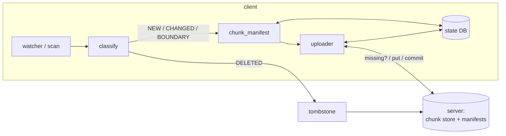
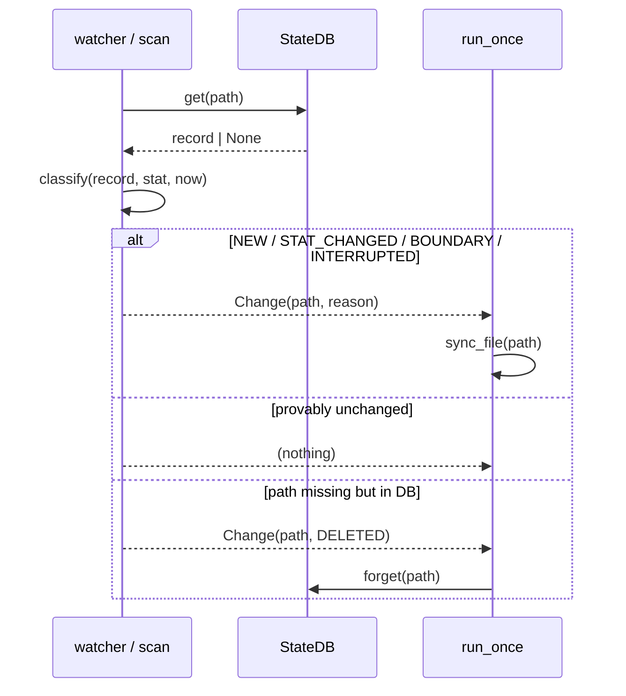
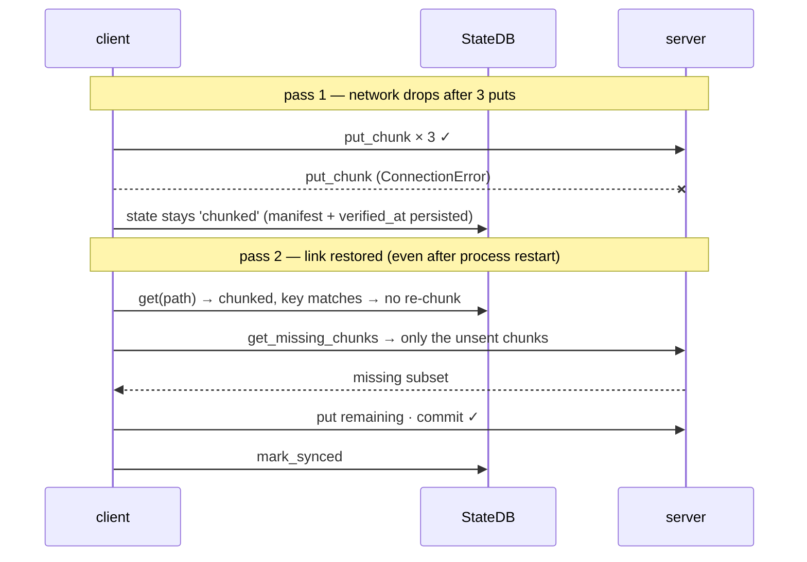

# File Synchronization Utility — runnable demo

A working client/server that turns the two library modules
(`change_detection.py`, `single_file_transfer.py`) into a system you can run,
break, and watch recover. The server is a small counterpart that exists only
to exercise the client, but it honours the parts of the contract the client's
correctness depends on (verify-on-write, reference-validating commits).

Everything here is validated by an end-to-end test that runs the **real**
server and drives it with the **real** HTTP client — no Docker required for the
proof. Docker only packages what that test already runs, adds a second server
so failover can be shown, adds an Nginx front proxy for domain-fronting
simulation, and adds network emulation so the reliability story is visible
rather than merely asserted.

```text
sync-demo/
├── server/            Flask server: content-addressed chunk store + RPCs
│   └── app.py
├── client/            the two assessed modules + the HTTP transport
│   ├── change_detection.py        assessed module: the classify() kernel
│   ├── single_file_transfer.py    assessed module: chunk + upload one file
│   └── transport.py               HTTP client with multi-server failover + run loop
├── scenarios/
│   ├── 01_normal_sync.sh          change detection · bandwidth · integrity · delete
│   ├── 02_interrupted_resume.sh   reliability: interrupt + resume under tc/netem
│   ├── 03_failover_and_blackout.sh
│   │                              failover/failback between two servers,
│   │                              degraded link, long outage
│   ├── 04_stealth_mode.sh         optional source deletion + domain fronting
│   └── 05_interactive_walkthrough.sh  interactive step-through for a live demo
├── tests/
│   ├── test_change_detection.py     unit tests for the pure classify() kernel
│   ├── test_classify_properties.py  property-based tests for the same kernel (hypothesis)
│   ├── test_integration_http.py     full flow over real HTTP (start here)
│   └── test_api_key_auth.py         opt-in SYNC_API_KEY auth, off by default
├── utils/network_conditions.py   tc/netem helper (Python twin of the scripts)
├── nginx/nginx.conf              reverse proxy for fronting simulation
├── certs/gen_certs.sh            throwaway TLS CA + server cert (stack runs HTTPS)
├── demo.sh                       one-command runner: quick | full | walkthrough
└── docker-compose.yml            two servers + Nginx + client on one bridge
```

## One-command demo

`demo.sh` runs the automated demo (`quick`, `full`) and the interactive
`walkthrough` side by side, writing timestamped markdown reports to `reports/`:

```bash
./demo.sh quick        # no Docker: integration test + requirement→evidence report
./demo.sh full         # Docker: the three automated scenarios (normal sync,
                       #   interrupted resume, failover + blackout), evidence
                       #   + logs report, teardown
./demo.sh walkthrough  # Docker: interactive step-through — create/edit/rename/
                       #   delete files (and an optional mid-transfer outage)
                       #   step by step, watching server chunk counts react
```

`quick` creates its own virtualenv on first run, so a fresh clone needs
nothing but Python 3.12+ (and Docker for the other two modes). `walkthrough`
pauses on Enter before each step so it can be narrated live; `--auto` runs
it unattended. The stealth-mode scenario (`04_stealth_mode.sh`) is run on its
own — see below — not as part of `full`.

## Quickest proof — no Docker

```bash
pip install -r client/requirements.txt -r server/requirements.txt -r tests/requirements.txt
python -m unittest tests/test_change_detection.py       # the pure kernel, 8 example cases
python -m unittest tests/test_classify_properties.py    # the same kernel, 6 generated properties
python tests/test_integration_http.py                   # the whole system, 11 checks
python tests/test_api_key_auth.py                        # opt-in auth, 4 checks
```

This starts the server as a subprocess (over TLS if `./certs/gen_certs.sh`
has been run) and exercises all four requirements plus resume, failover, and
three regression cases found during the code audit (empty files, a
transient permission error, one bad file among many), in about five
seconds:

```
0. server up over https (client verifying against certs/ca.crt)
1. initial sync ok: 2 files, server copies byte-exact (integrity)
2. no-op pass ok: unchanged tree does nothing (change detection)
3. 50 KB edit ok: only 1 new chunk(s) stored (bandwidth)
4. rename ok: new path committed with zero new chunks (dedup)
5. resume ok: dropped after 3 chunks (20 stored), reconnected and finished from persisted state (reliability)
6. restart ok: fresh client reuses persisted state, re-syncs nothing
7. delete ok: removed file tombstoned on server
   [transport] endpoint http://127.0.0.1:NNNNN marked unhealthy after 3 consecutive failures; failing over
8. failover ok: dead primary skipped, synced via secondary (reliability)
9. empty file ok: zero-byte file sync and server reassembly both succeed (reliability)
10. permission hiccup ok: an unreadable directory is not mistaken for a deletion (integrity)
11. per-file isolation ok: one file's unexpected exception does not block the rest of the pass (reliability)

ALL INTEGRATION CHECKS PASSED
```

See [`FINAL_REPORT.md`](FINAL_REPORT.md) for the full requirement-to-evidence
traceability, the code-audit findings and fixes, and the plot gallery.

## Architecture

The client is a five-stage pipeline around a SQLite state DB; the server is a
content-addressed store. Chunks are addressed by BLAKE3, so deduplication is
set membership and uploads are idempotent.



### Change-detection pass

`classify()` is a pure function of `(db record, stat, clock)`. The only time it
returns "unchanged" is when it can prove it; a matching stat whose mtime sits
within the guard window of the last **content verification** is treated as
inconclusive and re-read.



### Single-file transfer

Bandwidth, reliability, and integrity converge here. The manifest holds
`(offset, length, hash)` only, so resident file bytes stay at
`workers × max_chunk` regardless of file size.

```mermaid
sequenceDiagram
    participant C as client (sync_file)
    participant DB as StateDB
    participant S as server
    C->>C: stat, chunk_manifest (offsets+hashes only)
    C->>C: record verified_at; stat again  [torn-read guard]
    C->>DB: save_chunked(manifest, verified_at)
    C->>DB: prev_hashes(path)        %% local dedup baseline
    C->>S: get_missing_chunks(new hashes)
    S-->>C: missing subset
    loop each missing chunk
        C->>C: pread(offset,len) · zstd
        C->>S: put_chunk(hash, payload)
        S->>S: decompress · verify BLAKE3
        alt hash ok
            S-->>C: 204
        else mismatch
            S-->>C: 409 → ChunkRejected → mark_dirty, re-chunk next pass
        end
    end
    C->>S: commit_file(path, file_hash, chunk_hashes)
    alt all refs present
        S-->>C: ok
        C->>DB: mark_synced
    else refs GC'd meanwhile
        S-->>C: missing[] → re-upload → retry commit
    end
```

### Resume after interruption

A crash or drop after chunking leaves the row in `chunked` state with the
manifest persisted. The next pass sees the matching key, **skips re-chunking**,
and asks only for the chunks the server still lacks.



### Failover between servers

`HttpServer` takes a list of server URLs in priority order. A request goes to
the first endpoint believed healthy; a connection error, timeout or 5xx moves
it to the next one with no delay. After three consecutive failures an
endpoint is skipped until an active `GET /v1/health` probe says it is back,
and a downed higher-priority endpoint is re-probed every
`SYNC_HEALTH_CHECK_INTERVAL` seconds so the client **fails back** to the
primary once it recovers.

This is availability, not replication: the two servers are independent
stores. A file committed to the secondary during a primary outage lives on
the secondary; the client's state DB records it as synced and does not
re-send it to the primary later. Cross-server replication is a server-side
concern and out of scope here.

### Traffic mimicry and randomised timing (stealth mode)

The transport uses endpoint paths that resemble a generic telemetry/analytics
API (e.g. `/api/v1/collect`, `/api/v1/events/<hash>`, `/api/v1/session`,
`/api/v1/retract`) and includes dummy fields (`device_id`, `timestamp`,
`event_type`) in JSON bodies. The client also randomises the polling interval
using an exponential distribution (mean = `SYNC_INTERVAL`), and `run_once`
randomly chooses a healthy server per file to spread traffic across the two
independent stores. An optional `SYNC_DELETE_AFTER=true` causes the client to
remove the local file after a successful sync, simulating source deletion.

These features are exercised by `scenarios/04_stealth_mode.sh`, which runs a
one-off client container with `SYNC_DELETE_AFTER=true` and connects through
the Nginx front proxy.

## Run it in Docker with network emulation

```bash
./certs/gen_certs.sh                     # once: demo CA + server cert
docker compose up --build                # terminal 1: 2 servers + Nginx + client, TLS
./scenarios/01_normal_sync.sh            # terminal 2
./scenarios/02_interrupted_resume.sh     # terminal 2
./scenarios/03_failover_and_blackout.sh  # terminal 2 (~6 min; stops/starts primary)
./scenarios/04_stealth_mode.sh           # optional: source deletion + domain fronting
```

Drop files into `./sync-root/` and the client (polling with randomised
intervals around 3 s) syncs them. `01_normal_sync.sh` reads `GET /v1/stats`
before and after each step, so you can watch the stored-chunk count barely
move on an edit and — when the rename lands on the store that already holds the
file — not move at all (content-addressed dedup); when it lands on the other,
non-replicating store, the same chunks are re-homed there, which the script
reports honestly. `02_interrupted_resume.sh` shapes
the client container's own egress with `tc`/`netem` — 30 % loss, then a total
outage, then recovery — and asserts the server ends byte-identical with no
chunk stored twice. `03_failover_and_blackout.sh` stops the primary server
mid-run and shows the client failing over to the secondary, then failing back
when the primary returns, then syncing through a lossy link (10 % loss, 100 ms
delay) and a 60 s blackout. `04_stealth_mode.sh` demonstrates the optional
source deletion and connection through the Nginx front proxy. The shaping
needs the `NET_ADMIN` capability, which the compose file grants to the client
only; nothing on the host is touched.

## How it maps to the four requirements

| Requirement | Mechanism (and where to see it) |
|---|---|
| **Change detection** | `classify()` on `(size, mtime_ns)` vs. the state DB, guard window anchored at last content read. Scenario 1 steps 1–2; integration checks 2, 6. |
| **Bandwidth** | CDC chunking + server dedup (`/v1/missing`) + local pre-diff (`prev_hashes`) + per-chunk zstd. Scenario 1 steps 2–3 (chunk count); integration checks 3, 4. |
| **Reliability** | Idempotent content-addressed puts + persisted `chunked` state + bounded retry/backoff + GC-race-aware commit + multi-server failover + per-file exception isolation. Scenarios 2, 3; integration checks 5, 6, 8, 9, 11. |
| **Integrity** | Per-chunk BLAKE3 verified server-side on write; file identity = BLAKE3 of the ordered chunk hashes, recomputed and checked by the server on commit; commit validates references; a transient scan error is never mistaken for a deletion. Scenario 1 step 4; integration checks 1, 10. |

## TLS and the Nginx front proxy

The Docker stack runs over HTTPS. `./certs/gen_certs.sh` creates a throwaway
CA and one server certificate (SAN: `primary-server`, `secondary-server`,
`localhost`, `127.0.0.1`, `innocent-front.example.com`); `demo.sh` runs it
for you on first use, and `docker compose up` needs it to have been run once.
The backends serve HTTPS (`ssl_context` from the mounted cert/key) and the
client verifies them against the demo CA via `SYNC_CA_BUNDLE` — no
`verify=False` anywhere. The host-side scripts default to
`https://localhost:800x` and point `curl` at the same CA
(`CURL_CA_BUNDLE`); set `SRV=http://…` to run them against a plain stack. The
integration test uses the same certificates when they exist, so
`./demo.sh quick` exercises the TLS path without Docker.

An Nginx container (`front-proxy`) is also started. It terminates TLS for the
domain `innocent-front.example.com` and proxies to the two backends over
HTTPS. The `04_stealth_mode.sh` scenario uses this front as the target, while
the normal client continues to use the backends directly. This simulates a
domain-fronting arrangement without changing the client's normal behaviour.
The Nginx configuration is in `nginx/nginx.conf`; it verifies the upstream
certificate against the shared demo CA (`proxy_ssl_verify on`, with
`proxy_ssl_name` pointed at the real backend hostname, since nginx checks
the *upstream block's* name against the SAN by default, not the actual
server) rather than skipping verification — all services share the same
demo CA, so there is no reason not to check it.

## Optional auth: `SYNC_API_KEY`

Off by default (this is a demo lab; any client that can reach a server's
port can push or read chunks, same as always). Setting `SYNC_API_KEY` on a
server requires a matching `X-API-Key` header on every request, checked
with a constant-time comparison (`server/app.py`); setting it on the
client (`HttpServer(..., api_key=...)`, or the `SYNC_API_KEY` env var for
the `__main__` runner) sends that header on every request via the
thread-local session's default headers. Both sides must agree, or every
request 401s — see `tests/test_api_key_auth.py` for the no-key/wrong-key/
matching-key/end-to-end-sync cases.

## Deliberately out of scope

The server is a test counterpart, not a production service: chunk garbage
collection is stubbed (it validates references on commit but never actually
collects), authentication is opt-in and off by default (`SYNC_API_KEY`,
above), the two servers do not replicate to each other, and manifests are
versioned only to the extent the tombstone flag requires. The client
modules are the assessed artifact; this harness exists to run them honestly
under normal, adverse, and "covert-ish" conditions. The
stealth-oriented features (API-path mimicry, randomised polling, source
deletion, domain-fronting proxy) are **demonstrations only** — they do not
make the system immune to a determined network monitor, and no real
counter-forensics or encryption beyond TLS is provided.
